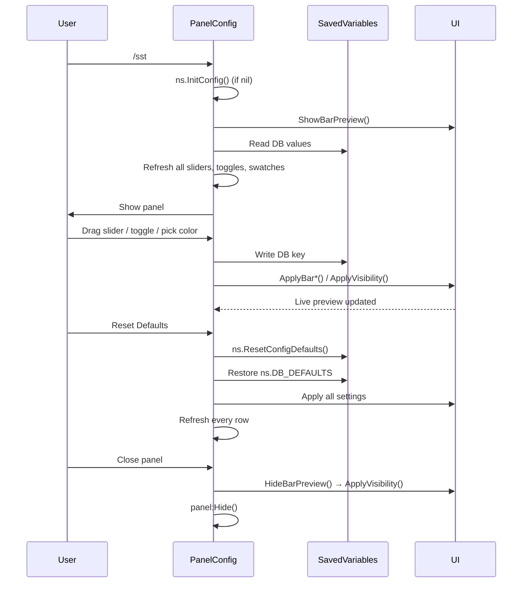
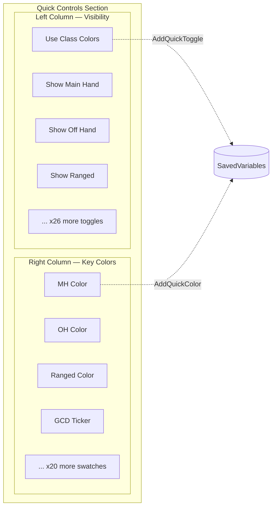
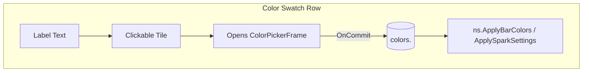
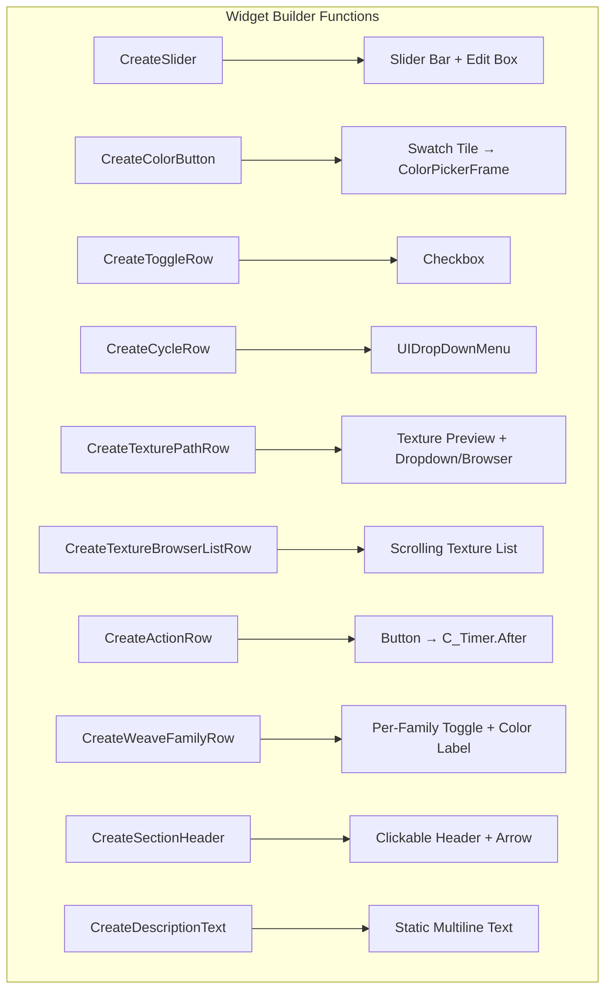
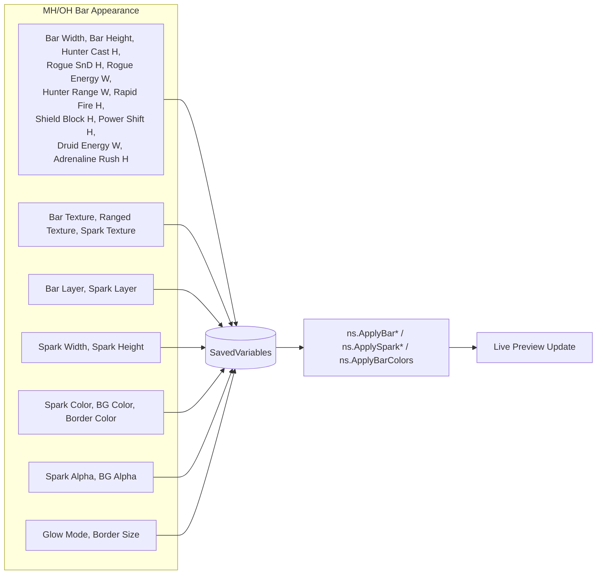

# Config Panel Reference (`/sst`)

Source: `SuperSwingTimer_Config.lua` (3729 lines)

## Frame structure

```mermaid
flowchart TB
    ScrollFrame[ScrollFrame - panel] --> QuickC[Quick Controls]
    ScrollFrame --> MhOh[MH/OH Bar Appearance]
    ScrollFrame --> Shaman[Shaman Weave Assist]
    ScrollFrame --> WeaveFam[Weave Families]
    ScrollFrame --> General[General Behavior]
    ScrollFrame --> ResetBtn[Reset Defaults Button]

    QuickC --> Toggles[Visibility Toggles<br/>AddQuickToggle x30]
    QuickC --> Colors[Color Swatches<br/>AddQuickColor x24]

    MhOh --> W[Slider - Bar Width]
    MhOh --> H[Slider - Bar Height]
    MhOh --> HCB[Slider - Hunter Cast Bar H]
    MhOh --> Tex1[TextureList - Bar Texture]
    MhOh --> Layer1[Cycle - Bar Layer]
    MhOh --> Tex2[TextureList - Ranged Texture]
    MhOh --> STex[TextureBrowser - Spark]
    MhOh --> SAlpha[Slider - Spark Alpha]
    MhOh --> SCol[Color - Spark Color]
    MhOh --> SLayer[Cycle - Spark Layer]
    MhOh --> SW[Slider - Spark Width]
    MhOh --> SH[Slider - Spark Height]
    MhOh --> BGCol[Color - BG Color]
    MhOh --> BGAlpha[Slider - BG Alpha]
    MhOh --> Glow[Cycle - Glow Mode]
    MhOh --> BorderCol[Color - Border Color]
    MhOh --> BorderSz[Slider - Border Size]

    Shaman --> WST[TextureBrowser - Weave Spark]
    Shaman --> WSL[Cycle - Weave Spark Layer]
    Shaman --> WSW[Slider - Weave Spark W]
    Shaman --> WSH[Slider - Weave Spark H]
    Shaman --> WSA[Slider - Weave Spark Alpha]
    Shaman --> Desc[Description Text]
    Shaman --> TL[Cycle - Triangle Layer]
    Shaman --> TSz[Slider - Triangle Size]
    Shaman --> TGap[Slider - Triangle Gap]
    Shaman --> TAlpha[Slider - Triangle Alpha]

    WeaveFam --> LB[LB Lightning Bolt]
    WeaveFam --> CL[CL Chain Lightning]
    WeaveFam --> HW[HW Healing Wave]
    WeaveFam --> LHW[LHW Lesser Healing Wave]
    WeaveFam --> CH[CH Chain Heal]

    General --> MM[Toggle - Minimal Mode]
    General --> Lock[Toggle - Lock Bars]
    General --> Test[Action - Test Bars 8s]
```



- `panel = CreatePanel()` — scrollable config frame, stored in `ns.panel`
- `ns.InitConfig()` / `ns.ToggleConfig()` — lazy-init + toggle
- `ns.ResetConfigDefaults()` — full reset to `ns.DB_DEFAULTS`
- `ns.RefreshTextureRows()` — refresh all 4 texture rows

## Config lifecycle



## Section headers (collapsible)

Each section uses `CreateSectionHeader(content, label, y, { rows, getCollapsed, setCollapsed })`.

| Section | Y offset | DB key (collapsed) | Rows |
|---------|----------|-------------------|------|
| Quick Controls | -10 | `sectionCollapsed.barVisibility` | Toggles + Colors |
| Bar Visibility | -10 | (same as Quick Controls) | barVisibilityRows[] |
| MH/OH Bar Appearance | PostQuickY(-230) | `sectionCollapsed.mhOh` | mhOhRows[25] |
| Shaman Weave Assist | PostQuickY(-750) | `sectionCollapsed.shaman` | shamanRows[10] |
| General Behavior | PostQuickY(-1340) | `sectionCollapsed.general` | generalRows[3] |
| Weave Families | PostQuickY(-1708) | `sectionCollapsed.weaveFamilies` | weaveFamiliesRows[6] |

## Quick Controls — two-column layout



All toggles use `AddQuickToggle(label, getValue, applyValue, opts)` — renders as a checkbox row.

### Visibility toggles

| Label | DB key | Affects | Class |
|-------|--------|---------|-------|
| Use Class Colors | `useClassColors` | `ns.ApplyBarColors()` | All |
| Show Main Hand | `showMH` | `ns.ApplyVisibility()` | `cfg.melee` |
| Show Off Hand | `showOH` | `ns.ApplyVisibility()` | `cfg.dualWield` |
| Show Ranged | `showRanged` | `ns.ApplyVisibility()` | `cfg.ranged` |
| Hunter Range Helper | `showHunterRangeHelper` | `UpdateHunterRangeHelperVisual()` | Hunter |
| Rapid Fire Bar | `showHunterRapidFireBar` | (toggle) | Hunter |
| Show Enemy Bar | `showEnemy` | `ns.ApplyVisibility()` | All |
| Shaman Weave Assist | `showWeaveAssist` | `ns.ApplyVisibility()` | Shaman |
| Windfury ICD | `showShamanWindfuryIcd` | (toggle) | Shaman |
| Rogue SS Cue | `showRogueSinisterAssist` | `UpdateRogueSinisterAssistVisual()` | Rogue |
| Rogue Energy Tick | `showRogueEnergyTick` | `UpdateRogueEnergyTickVisual()` | Rogue |
| Rogue Slice and Dice | `showRogueSliceAndDice` | `UpdateRogueSliceAndDiceVisual()` | Rogue |
| Rogue Combo Points | `showRogueComboPoints` | `UpdateRogueComboPointVisual()` | Rogue |
| Rogue Adrenaline Rush | `showRogueAdrenalineRushBar` | (toggle) | Rogue |
| Warrior Flurry | `showWarriorFlurryCounter` | (toggle) | Warrior |
| Omen of Clarity | `showDruidOmenGlow` | (legacy — stripped v0.0.9) | Druid |
| Swing Flash | `showSwingFlash` | (toggle) | All (Phase 1) |
| GCD Ticker | `showGcdTicker` | (toggle) | Melee (non-Hunter) |
| Rage Dim | `showDruidRageDim` | (legacy — stripped v0.0.9) | Druid |
| Energy Countdown | `showRogueEnergyCountdown` | (toggle) | Rogue |
| Shield Block | `showWarriorShieldBlockBar` | (toggle) | Warrior |
| Warrior Rage Bar | `showWarriorRageBar` | `ns.ApplyVisibility()` | Warrior |
| Protection Hide | `showWarriorRageProtection` | (toggle) | Warrior |
| Druid Form Colors | `showDruidFormColors` | (legacy — stripped v0.0.9) | Druid |
| Ravage Cue | `showDruidRavageCue` | (legacy — stripped v0.0.9) | Druid |
| Power Shift | `showDruidPowerShiftBar` | (legacy — stripped v0.0.9) | Druid |
| Druid Energy Tick | `showDruidEnergyTickBar` | (legacy — stripped v0.0.9) | Druid |
| Paladin Seal Color | `showPaladinSealColor` | `ns.ApplyBarColors()` | Paladin |
| Paladin Seal Label | `showPaladinSealLabel` | `ns.ApplyBarColors()` | Paladin |
| Paladin Judgement CD | `showPaladinJudgementMarker` | `ns.ApplyBarColors()` | Paladin |
| Paladin Twist Flash | `showPaladinTwistFlash` | `ns.ApplyBarColors()` | Paladin |

### Color swatches

All use `AddQuickColor(label, colorKey, { allowAlpha, tooltipText })` — renders as a text label + clickable color tile.



| Label | DB key `colors.<key>` | Default RGBA (from DB_DEFAULTS) |
|-------|----------------------|-------------------------------|
| MH Color | `mh` | `{0,0,0,1}` |
| OH Color | `oh` | `{0,0,0,1}` |
| Ranged Color | `ranged` | `{0,0,0,1}` |
| GCD Ticker | `gcdTickerColor` | `{0.30,0.70,1.00,0.85}` |
| Range Melee | `hunterRangeMelee` | `{0.20,0.85,0.25,1}` |
| Range Sweet Spot | `hunterRangeSweetSpot` | `{0.98,0.82,0.18,1}` |
| Range Ranged | `hunterRangeRanged` | `{0.20,0.55,1.00,1}` |
| Range Out | `hunterRangeOutOfRange` | `{0.50,0.50,0.50,1}` |
| Auto Shot Safe | `autoShotSafe` | `{0.2,0.78,0.25,0.4}` |
| Auto Shot Late | `autoShotUnsafe` | `{1,0,0,0.4}` |
| Rapid Fire | `rapidFireBar` | `{0.15,0.85,0.45,0.85}` |
| Enemy Color | `enemy` | `{1,0,0,1}` |
| Rogue SS Cue | `rogueSinister` | `{1,0,0,0.35}` |
| Rogue Energy Tick | `rogueEnergyTick` | `{1.0,0.82,0.18,1}` |
| Rogue Combo | `rogueComboPoints` | `{1.0,0.18,0.12,0.95}` |
| Rogue SnD | `rogueSliceAndDice` | `{0.95,0.82,0.22,0.95}` |
| Rogue Adrenaline Rush | `adrenalineRushBar` | `{1.0,0.40,0.10,0.85}` |
| Ravage Cue | `ravageCue` | `{1.00,0.72,0.16,0.28}` (legacy — stripped v0.0.9) |
| Seal Line | `sealTwist` | `{1,0,0,0.35}` |
| Flurry Counter | `flurryCounter` | `{1.0,0.75,0.10,1.0}` |
| Shield Block | `shieldBlockBar` | `{0.20,0.55,1.00,0.90}` |
| Windfury ICD | `windfuryIcd` | `{0.85,0.45,0.0,0.80}` |
| Omen Glow | `omenGlow` | `{0.20,1.0,0.30,0.80}` (legacy — stripped v0.0.9) |
| Rogue Energy Text | `rogueEnergyText` | `{1.0,0.82,0.18,0.85}` |

## Control widget types



## MH/OH Bar Appearance section (mhOhRows[25])

This section controls everything visual about the bars: dimensions, textures, spark, colors, borders.



| # | Row type | Label | DB key | Range | Class |
|---|----------|-------|--------|-------|-------|
| 1 | Slider | Bar Width | `barWidth` | 100–400 | All |
| 2 | Slider | Bar Height | `barHeight` | 10–40 | All |
| 3 | Slider | Hunter Cast Bar Height | `hunterCastBarHeight` | 4–30 | Hunter |
| 4 | Slider | Rogue SnD Bar Height | `rogueSliceAndDiceBarHeight` | 2–10 | Rogue |
| 5 | Slider | Rogue Energy Tick Width | `rogueEnergyTickBarWidth` | 2–20 | Rogue |
| 6 | Slider | Hunter Range Helper Width | `hunterRangeHelperWidth` | 2–20 | Hunter |
| 7 | Slider | Hunter Rapid Fire Height | `hunterRapidFireBarHeight` | 2–20 | Hunter |
| 8 | Slider | Warrior Shield Block Height | `warriorShieldBlockBarHeight` | 2–20 | Warrior |
| 9 | Slider | Druid Power Shift Height | `druidPowerShiftBarHeight` | 2–20 | Druid (legacy — stripped v0.0.9; sliders not created) |
| 10 | Slider | Druid Energy Tick Width | `druidEnergyTickBarWidth` | 2–20 | Druid (legacy — stripped v0.0.9; sliders not created) |
| 11 | Slider | Rogue Adrenaline Rush Height | `rogueAdrenalineRushBarHeight` | 2–20 | Rogue |
| 12 | TextureList | MH/OH Bar Texture | `barTexture` | Blizzard/WA/SharedMedia | All |
| 13 | Cycle | MH/OH Texture Layer | `barTextureLayer` | `TEXTURE_LAYER_OPTIONS` | All |
| 14 | TextureList | Ranged Bar Texture | `rangedBarTexture` | Blizzard/WA/SharedMedia | Hunter |
| 15 | TextureBrowser | Spark Texture | `sparkTexture` | Browser | All |
| 16 | Slider | Spark Alpha | `sparkAlpha` | 0–1 | All |
| 17 | Color | Spark Color | `sparkColor` | Alpha enabled | All |
| 18 | Cycle | Spark Layer | `sparkTextureLayer` | `TEXTURE_LAYER_OPTIONS` | All |
| 19 | Slider | Spark Width | `sparkWidth` | 2–60 | All |
| 20 | Slider | Spark Height | `sparkHeight` | 2–90 | All |
| 21 | Color | Bar Background Color | `barBackgroundColor` | No alpha | All |
| 22 | Slider | Bar Background Alpha | `barBackgroundAlpha` | 0–1 | All |
| 23 | Cycle | Indicator Glow Mode | `indicatorBlendMode` | Glow(ADD) / Opaque(BLEND) | All |
| 24 | Color | Bar Border Color | `barBorderColor` | Alpha enabled | All |
| 25 | Slider | Bar Border Size | `barBorderSize` | 0–6 | All |

## Shaman Weave Assist section (shamanRows[10])

Hidden for non-Shaman classes.

| # | Row type | Label | DB key | Range |
|---|----------|-------|--------|-------|
| 1 | TextureBrowser | Cast Breakpoint Spark Texture | `weaveSparkTexture` | — |
| 2 | Cycle | Cast Breakpoint Layer | `weaveSparkTextureLayer` | — |
| 3 | Slider | Cast Spark Width | `weaveSparkWidth` | 2–60 |
| 4 | Slider | Cast Spark Height | `weaveSparkHeight` | 2–100 |
| 5 | Slider | Cast Spark Alpha | `weaveSparkAlpha` | 0–1 |
| 6 | Description | NOTE about spell icons | (static text) | — |
| 7 | Cycle | Spell Icon Layer | `weaveTriangleTextureLayer` | — |
| 8 | Slider | Spell Icon Size | `weaveTriangleSize` | 6–24 |
| 9 | Slider | Spell Icon Gap | `weaveTriangleGap` | 0–6 |
| 10 | Slider | Spell Icon Alpha | `weaveTriangleAlpha` | 0–1 |

## Weave Families section (weaveFamiliesRows[6])

Hidden for non-Shaman classes.

| Row | Label | Family key | Spell IDs |
|-----|-------|-----------|-----------|
| Description | "Each family below is color-coded..." | (static) | — |
| 1 | LB (Lightning Bolt) | `weaveSpellFamilies.LB` | 403–492+ |
| 2 | CL (Chain Lightning) | `weaveSpellFamilies.CL` | 421–452+ |
| 3 | HW (Healing Wave) | `weaveSpellFamilies.HW` | 331–959+ |
| 4 | LHW (Lesser Healing Wave) | `weaveSpellFamilies.LHW` | 8004–25423+ |
| 5 | CH (Chain Heal) | `weaveSpellFamilies.CH` | 1064–55460+ |

## General Behavior section (generalRows[3])

| # | Row type | Label | DB key |
|---|----------|-------|--------|
| 1 | Toggle | Minimal Mode | `minimalMode` |
| 2 | Toggle | Lock / Unlock Bars | `lockBars` |
| 3 | Action | Test Bars | Preview 8s (temporary) |

## Reset Defaults button

```mermaid
flowchart TD
    Reset[Reset Defaults Click] --> RCD[ns.ResetConfigDefaults]
    RCD --> DBRes[Restore all ns.DB_DEFAULTS]
    RCD --> Slider[Reset slider values]
    RCD --> Refresh[Refresh all .refresh() callbacks]
    Refresh --> Toggles[Toggle rows x30]
    Refresh --> Swatches[Color swatches x24]
    Refresh --> Texture[Texture rows x4]
    Refresh --> Cycles[Cycle rows x5]
    RCD --> Apply[ns.ApplyBar* / ApplyVisibility]
    Apply --> Live[Live preview updated]
```

## Constants

- `INDICATOR_BLEND_OPTIONS` = `{ {label="Glow",value="ADD"}, {label="Opaque",value="BLEND"} }`
- `TEXTURE_BROWSER_CATEGORY_CHOICES` = All, Shapes(WeakAuras), SharedMedia, Blizzard, Platynator
- `LAYOUT_SCALE = 1.6`, `LAYOUT_SHIFT = 120`
- `BAR_COLOR_KEYS` = `{ "mh", "oh", "ranged" }` — keys affected by Use Class Colors
- `quickRowStep = -30` (spacing between quick control rows)

## Key functions

| Function | Line | Purpose |
|----------|------|---------|
| `ns.InitConfig()` | 3182 | Create panel if nil |
| `ns.ToggleConfig()` | 3189 | Show/hide panel, refresh all values |
| `ns.ResetConfigDefaults()` | 3335 | Full DB reset + visual refresh |
| `ns.RefreshTextureRows()` | 3167 | Refresh 4 texture rows |
| `ShowBarPreview()` | 272 | Show bars while panel open |
| `HideBarPreview()` | 314 | Hide bars after panel close, defer to ApplyVisibility |
| `StartBarTestPreview(8)` | 338 | 8-second test bars via C_Timer.NewTimer |
| `SavePreClassColorState()` | 222 | Backup manual colors before enabling class colors |
| `RestoreColorsAfterClassToggleDisabled()` | 238 | Restore manual colors when class color toggle off |
| `CreateSlider()` | 418 | Slider + numeric edit box pair |
| `CreateColorButton()` | 472 | Color swatch → ColorPickerFrame |
| `CreateToggleRow()` | early | Checkbox toggle |
| `CreateCycleRow()` | early | UIDropDownMenu cycle |
| `CreateTexturePathRow()` | early | Texture browser + dropdown |
| `CreateTextureBrowserListRow()` | early | Scrolling texture preview list |
| `CreateActionRow()` | early | Action button |
| `CreateWeaveFamilyRow()` | early | Per-family toggle + color |
| `CreateSectionHeader()` | early | Collapsible header |
| `CreateDescriptionText()` | early | Static text block |
| `AddRowHoverHighlight()` | 148 | Hover highlight texture |
| `AddControlTooltip()` | 159 | GameTooltip via HookScript |
| `SetRowsShown()` | 188 | Show/hide row array |
| `EnableScrollFrameMouseWheel()` | 61 | Mouse wheel scroll |

---
**🔄 Sync hook:** If config panel DB keys, control rows, section structure, or texture browser patterns change, update this file. Master protocol → `standards/code.md`
