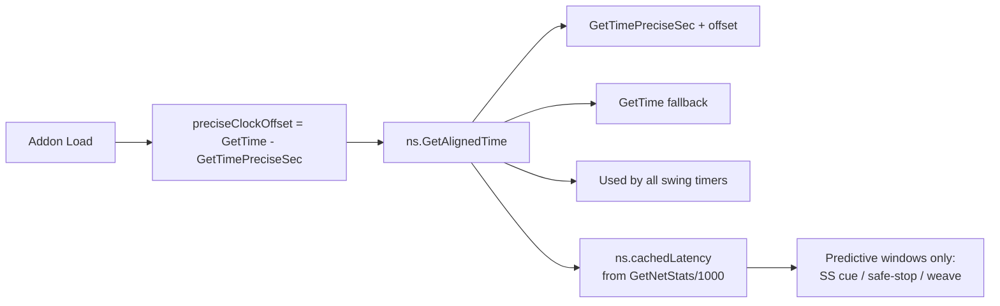
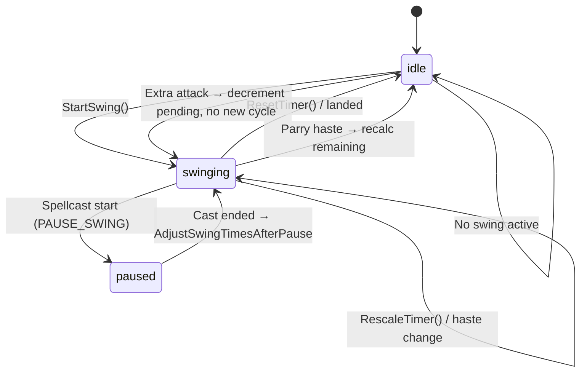
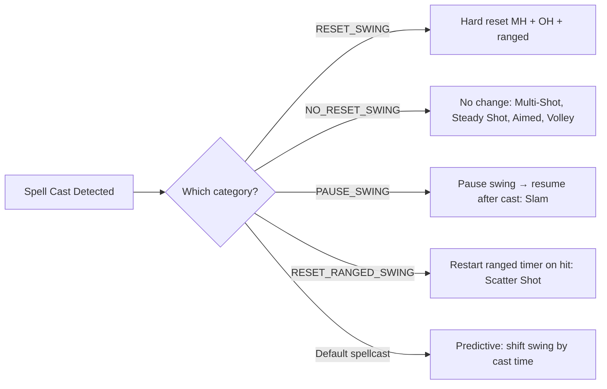
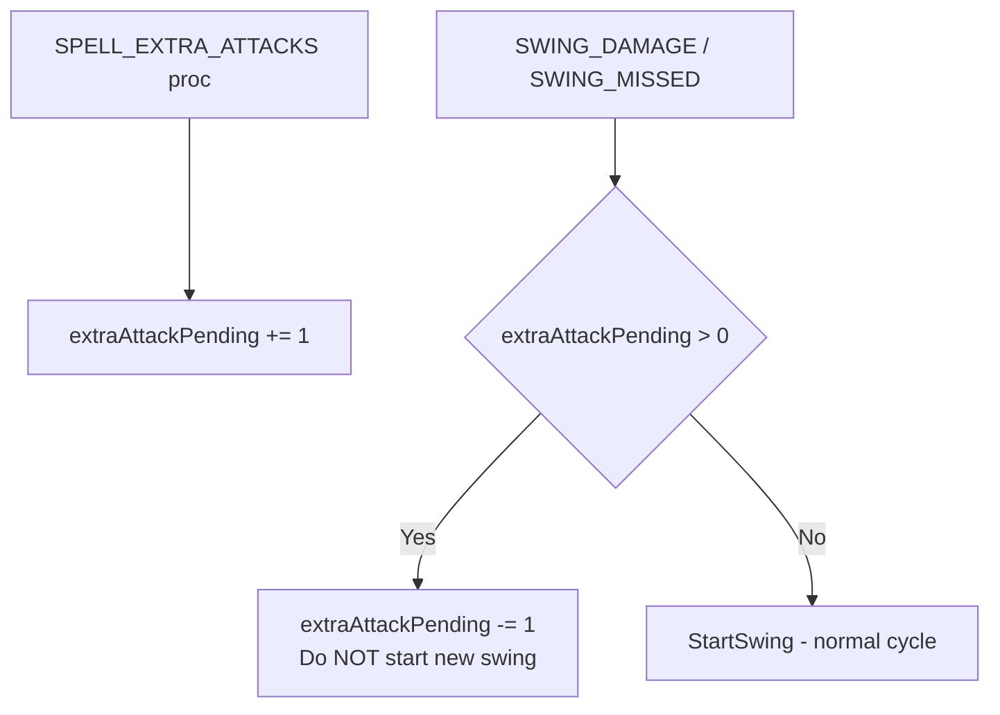
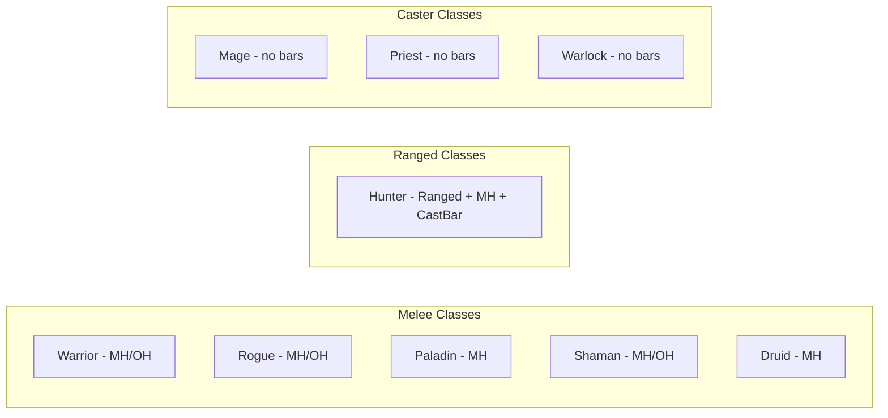
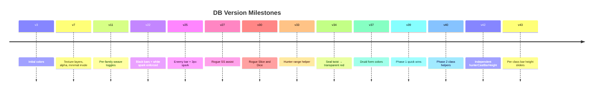

# Core Timing Reference — Super Swing Timer

> Source-of-truth values extracted from `SuperSwingTimer_Constants.lua`, `SuperSwingTimer_State.lua`, `SuperSwingTimer_UI.lua`, and `SuperSwingTimer.lua`. When in doubt about a timing value, check the `.lua` files above.

---

## 1. Clock Domain



| Detail | Value |
|--------|-------|
| Preferred clock | `GetTimePreciseSec()` (aligned to `GetTime()` domain via `ns.preciseClockOffset`) |
| Fallback clock | `GetTime()` |
| Accessor | `ns.GetAlignedTime()` — returns `GetTimePreciseSec() + offset` or `GetTime()` |
| Local alias in State | `GetCurrentTime()` — calls `ns.GetAlignedTime()` with fallback |
| Precision offset | Computed once at load: `offset = GetTime() - GetTimePreciseSec()` |
| Latency domain | `ns.cachedLatency` → applied **only** to predictive windows (SS cue, safe-stop, weave markers) |

**Rule**: Always use `ns.GetAlignedTime()` or `GetCurrentTime()`. Never use bare `GetTime()`.

---

## 2. Timing Constants (all files)

| Constant | Value | Source | Purpose |
|----------|-------|--------|---------|
| `ns.CAST_WINDOW` | `0.5` | Constants.lua:83 | Hidden hunter/ranged cast window in TBC |
| `ns.STEADY_SHOT_CAST_TIME` | `1.5` | Constants.lua:94 | TBC Steady Shot — haste-immune |
| `ns.STEADY_SHOT_GRACE` | `0.5` | Constants.lua:95 | Auto Shot fires during last 0.5s of SS without clipping |
| `ns.GCD_DURATION` | `1.5` | State.lua:824 | Global cooldown for all melee classes |
| `ns.PALADIN_JUDGEMENT_COOLDOWN` | `10` | Constants.lua:315 | Base Judgement CD (talents reduce it) |
| Paladin seal twist window | `0.4 + cachedLatency` | ClassMods (inline) | Computed — no named constant |
| `LATENCY_REFRESH_INTERVAL` | `0.05` | SuperSwingTimer.lua:22 | Latency cache refresh throttle |
| `SPEED_CHECK_INTERVAL` | `0.10` | State.lua:537 | Melee/ranged speed resync throttle |
| `RANGED_START_DEDUPE_WINDOW` | `0.25` | State.lua:26 | Dedupe = `max(0.25, cachedLatency + 0.05)` |
| Swing flash duration | `0.08` | State.lua:41 | Brief bar flash on swing landing |
| Swing start fallback speed | `2.0` | State.lua:621,629,634 | Generic placeholder when no speed known |

### Spell ID constants (Constants.lua:86-116)

| Constant | ID | Purpose |
|----------|-----|---------|
| `ns.AUTO_SHOT_ID` | `75` | Auto Shot |
| `ns.WING_CLIP_ID` | `2974` | Hunter Wing Clip |
| `ns.STEADY_SHOT_ID` | `34120` | TBC Steady Shot |
| `ns.HUNTER_READINESS_ID` | `23989` | Hunter Readiness (resets RF + other CDs) |
| `ns.ROGUE_ADRENALINE_RUSH_ID` | `13750` | Rogue Adrenaline Rush |
| `ns.WARRIOR_BLOODTHIRST_ID` | `23881` | Warrior Bloodthirst |
| `ns.WARRIOR_WHIRLWIND_ID` | `1680` | Warrior Whirlwind |
| `ns.WARRIOR_OVERPOWER_ID` | `7384` | Warrior Overpower |
| `ns.DRUID_TIGER_FURY_ID` | `5217` | Druid Tiger's Fury |
| `ns.SHAMAN_STORMSTRIKE_ID` | `17364` | Shaman Stormstrike |
| `ns.SHAMANISTIC_RAGE_ID` | `30823` | Shaman Shamanistic Rage |
| `ns.ROGUE_SLICE_AND_DICE_ID` | `5171` | Rogue Slice and Dice |
| `ns.SHIELD_BLOCK_ID` | `2565` | Warrior Shield Block |
| `ns.RAVAGE_ID` | `6785` | Druid Ravage |

### Hunter spell tables (Constants.lua:117-241)

| Table / Function | Content | Purpose |
|------------------|---------|---------|
| `ns.HUNTER_CAST_SPELLS` | Auto Shot + Multi-Shot (6 ranks) + Steady Shot + Aimed Shot (7 ranks) | All hunter spells that interact with ranged swing |
| `ns.HUNTER_ACTUAL_CAST_SPELLS` | Steady Shot + Aimed Shot (7 ranks) | Subset: spells with visible cast bars (excludes Auto Shot, Multi-Shot) |
| `ns.MULTI_SHOT_IDS` | Multi-Shot ranks 1-6 | TBC instant-shot hidden-window tracking |
| `ns.IsAutoShotSpell(v)` | — | Returns true if value is Auto Shot ID or name |
| `ns.IsHunterCastSpell(v)` | — | Returns true if value is in HUNTER_CAST_SPELLS |
| `ns.IsHunterActualCastSpell(v)` | — | Returns true if value is in HUNTER_ACTUAL_CAST_SPELLS (real casts only) |
| `ns.IsMultiShotSpell(v)` | — | Returns true if value is in MULTI_SHOT_IDS |

### UI helper bar size constants (Constants.lua:71-83)

| Constant | Default | Purpose |
|----------|---------|---------|
| `ns.BAR_WIDTH` | `240` | Main bar width |
| `ns.BAR_HEIGHT` | `15` | Main bar height |
| `ns.HUNTER_CAST_BAR_HEIGHT` | `10` | Dedicated hunter cast bar height |
| `ns.HUNTER_CAST_BAR_GAP` | `2` | Gap between bars |
| `ns.HUNTER_RANGE_HELPER_WIDTH` | `7` | Hunter range helper bar width |
| `ns.ROGUE_SLICE_AND_DICE_BAR_HEIGHT` | `4` | Rogue SnD bar height |
| `ns.ROGUE_ENERGY_TICK_BAR_WIDTH` | `4` | Rogue energy tick bar width |
| `ns.WARRIOR_SHIELD_BLOCK_BAR_HEIGHT` | `4` | Warrior Shield Block bar height |
| `ns.HUNTER_RAPID_FIRE_BAR_HEIGHT` | `4` | Hunter Rapid Fire bar height |

---

## 3. Latency Model

```mermaid
flowchart LR
    Cast[HandleSpellcastStart/Delayed] -->|LATENCY_REFRESH_INTERVAL=0.05s| Refresh1[RefreshLatencyCache]
    Ticker[Sanity Ticker] -->|every 1.0s| Refresh2[RefreshLatencyCache]
    Refresh1 --> Net[GetNetStats]
    Refresh2 --> Net
    Net --> Lat[cachedLatency = max(latency/1000, 0)]
    Lat --> Ranged[GetRangedCastWindow = 0.5 + cachedLatency]
    Lat --> Pala[Paladin twist = 0.4 + cachedLatency]
    Lat --> Rogue[Rogue SS cue = 0.4 + cachedLatency]
    Lat --> Shaman[Weave breakpoint = castTime + cachedLatency]
```

### GetRangedCastWindow() (UI.lua:28-35)
```
GetRangedCastWindow() = CAST_WINDOW + cachedLatency
                       = 0.5 + cachedLatency
```

---

## 4. Swing Timer Slots

| Slot | Source | Speed source | Visibility |
|------|--------|-------------|------------|
| `mh` | CLEU `SWING_DAMAGE`/`SWING_MISSED` (player) | `UnitAttackSpeed("player")` → mhSpeed | Combat + swinging |
| `oh` | CLEU `SWING_DAMAGE`/`SWING_MISSED` (player, off-hand) | `UnitAttackSpeed("player")` → ohSpeed | Combat + swinging |
| `ranged` | CLEU `SPELL_CAST_SUCCESS` (Auto Shot), `GetSpellCooldown(75)` | `GetSpellCooldown(75)` → `UnitRangedDamage()` → haste fallback | Combat + auto-repeating |
| `enemy` | CLEU `SWING_DAMAGE`/`SWING_MISSED` (target) | `UnitAttackSpeed("target")` | Combat + target valid |

### Swing lifecycle



```
StartSwing(slot):
  speed  = getWeaponSpeed()
  lastSwing = now (or combat-log timestamp)
  duration = speed
  state = "swinging"
  nextSpeedCheckAt = now

ResetTimer(slot):
  state = "idle"
  lastSwing = 0, duration = 0, speed = 0

RescaleTimer(slot, newSpeed):
  ratio = newSpeed / duration
  newRemaining = remaining * ratio
  lastSwing = now + newRemaining - newSpeed
  duration = newSpeed
```

---

## 5. Spell Reset/Pause Categories (Constants.lua:435-484)



| Category | Effect | Spells |
|----------|--------|--------|
| `RESET_SWING_SPELLS` | Hard-reset MH + OH + ranged swing | Repentance (16589, 2645, 51533), Ghost Wolf (2643...), Hammer of Justice (853, 5588, 5589, 10308), Holy Wrath (2812, 10318, 27139) |
| `NO_RESET_SWING_SPELLS` | Prevent swing reset on spellcast | Multi-Shot ranks, Steady Shot, Aimed Shot ranks, Volley, and various stun/fear/root spells |
| `PAUSE_SWING_SPELLS` | Pause then resume swing timing | Slam ranks 1-6 (1464, 8820, 11604, 11605, 25241, 25242) |
| `RESET_RANGED_SWING_SPELLS` | Restart ranged swing on hit | Scatter Shot (14295, 11925, 11951) |

### Swing adjustment on pause (State.lua:694-708)
```
AdjustSwingTimesAfterPause(now):
  if pauseSwingTime is nil: return
  offset = now - pauseSwingTime
  mh.lastSwing += offset
  oh.lastSwing += offset
  pauseSwingTime = nil
```

---

## 6. Parry Haste Math (State.lua:936-956)

```
remaining   = (lastSwing + duration) - now
floor       = 0.2 * duration       // never below 20% remaining
reduction   = 0.4 * duration       // reduce by 40% of full swing duration
newRemaining = max(remaining - reduction, floor)
lastSwing   = now + newRemaining - duration
```

```mermaid
flowchart LR
    ParryEvent[CLEU SWING_MISSED<br/>missType=PARRY] --> ReadTimer[Read remaining swing time]
    ReadTimer --> CalcFloor[floor = 20% of duration]
    ReadTimer --> CalcReduce[reduction = 40% of full duration]
    CalcFloor --> NewRem[newRemaining = max(remaining - reduction, floor)]
    CalcReduce --> NewRem
    NewRem --> Shift[Shift lastSwing forward by newRemaining - duration]
    Shift --> MH[Applied to MH slot only]
```

- Triggered by CLEU `SWING_MISSED` with missType `"PARRY"` — player is the target
- Applied to MH slot only

---

## 7. Extra Attack Suppression (State.lua:1046-1075)

```
CLEU SPELL_EXTRA_ATTACKS:
  extraAttackPending += extraAttackAmount (or 1)

On SWING_DAMAGE / SWING_MISSED:
  if extraAttackPending > 0:
    extraAttackPending -= 1        // skip reset, this is a "free" swing
  else:
    StartSwing(slot)               // normal swing reset
```



- Covers Windfury Totem, Sword Specialization, etc.
- Prevents double-counting extra attack procs as full new swing cycles

---

## 8. Bar Height/Width Math (Constants.lua:1178-1211, SuperSwingTimer.lua:800-810)

| Bar element | Formula | Source fn | From 15px MH |
|-------------|---------|-----------|-------------|
| OH bar | `max(6, mhHeight - 7)` | `ns.GetOffHandBarHeight()` | `8px` |
| Rogue SnD | `max(3, min(4, floor(mhHeight * 0.3)))` | `ns.GetRogueSliceAndDiceBarHeight()` | `3-4px` |
| Rogue combo points | `max(2, min(4, floor(mhHeight * 0.27)))` | `ns.GetRogueComboPointBarHeight()` | `2-4px` |
| Hunter cast bar | `HUNTER_CAST_BAR_HEIGHT` | DB `hunterCastBarHeight` (default 10) | `10px` |
| Hunter range helper | `HUNTER_RANGE_HELPER_WIDTH` | DB `hunterRangeHelperWidth` (default 7) | width, not height |
| Hunter Rapid Fire bar | `HUNTER_RAPID_FIRE_BAR_HEIGHT` | DB `hunterRapidFireBarHeight` (default 4) | `4px` |
| Rogue energy tick | `ROGUE_ENERGY_TICK_BAR_WIDTH` | DB `rogueEnergyTickBarWidth` (default 4) | width `4px` |
| Rogue Adrenaline Rush | `ROGUE_ADRENALINE_RUSH_BAR_HEIGHT` | DB `rogueAdrenalineRushBarHeight` (default 4) | `4px` |
| Warrior Shield Block | `WARRIOR_SHIELD_BLOCK_BAR_HEIGHT` | DB `warriorShieldBlockBarHeight` (default 4) | `4px` |
| Druid Power Shift | `DRUID_POWER_SHIFT_BAR_HEIGHT` | DB `druidPowerShiftBarHeight` (default 4) | `4px` |
| Druid energy tick | `DRUID_ENERGY_TICK_BAR_WIDTH` | DB `druidEnergyTickBarWidth` (default 4) | width `4px` |

Runtime overrides (SuperSwingTimer.lua:800-810): After migration, `OnAddonLoaded` copies DB values to `ns.*` constants, preferring DB → `ns.*` fallback → `ns.DB_DEFAULTS.*`.

---

## 9. Class Config Matrix (Constants.lua:532-542)



| Class | Ranged | Melee | DualWield | HunterCastBar |
|-------|--------|-------|-----------|---------------|
| HUNTER | ✅ | ✅ | ❌ | ✅ |
| WARRIOR | ❌ | ✅ | ✅ | ❌ |
| ROGUE | ❌ | ✅ | ✅ | ❌ |
| PALADIN | ❌ | ✅ | ❌ | ❌ |
| SHAMAN | ❌ | ✅ | ✅ | ❌ |
| DRUID | ❌ | ✅ | ❌ | ❌ |
| MAGE | ❌ | ❌ | ❌ | ❌ |
| PRIEST | ❌ | ❌ | ❌ | ❌ |
| WARLOCK | ❌ | ❌ | ❌ | ❌ |

---

## 10. SavedVariables Version Timeline



Full migration changelog: `references/db-migrations.md`

---

## 11. Default Color Quick Reference (DB_DEFAULTS.colors)

| Key | RGBA | Purpose |
|-----|------|---------|
| `mh` | `{0,0,0,1}` | Main hand bar |
| `oh` | `{0,0,0,1}` | Off hand bar |
| `ranged` | `{0,0,0,1}` | Ranged bar |
| `enemy` | `{1,0,0,1}` | Enemy bar |
| `autoShotSafe` | `{0.2,0.78,0.25,0.4}` | Hunter safe stop zone |
| `autoShotUnsafe` | `{1,0,0,0.4}` | Hunter unsafe/red zone |
| `rogueSinister` | `{1,0,0,0.35}` | SS cue window |
| `rogueEnergyTick` | `{1.0,0.82,0.18,1}` | Energy tick bar |
| `rogueEnergyTotal` | `{0.98,0.90,0.24,0.9}` | Rogue total-energy battery |
| `rogueComboPoints` | `{1.0,0.18,0.12,0.95}` | Rogue combo point boxes |
| `rogueSliceAndDice` | `{0.95,0.82,0.22,0.95}` | SnD bar |
| `rogueEnergyText` | `{1.0,0.82,0.18,0.85}` | Rogue energy text label |
| `sealTwist` | `{1,0,0,0.35}` | Paladin twist zone |
| `hunterRangeMelee` | `{0.20,0.85,0.25,1}` | Hunter range — melee distance |
| `hunterRangeSweetSpot` | `{0.98,0.82,0.18,1}` | Hunter range — sweet spot |
| `hunterRangeRanged` | `{0.20,0.55,1.00,1}` | Hunter range — shootable |
| `hunterRangeOutOfRange` | `{0.50,0.50,0.50,1}` | Hunter range — out of range |
| `shieldBlockBar` | `{0.20,0.55,1.00,0.90}` | Shield Block duration bar |
| `ravageCue` | `{1.00,0.72,0.16,0.28}` | Cat form Ravage cue |
| `gcdTickerColor` | `{0.30,0.70,1.00,0.85}` | GCD ticker bar (inside colors table) |
| `warriorRageBarColor` | `{0.80,0.20,0.10,0.85}` | Warrior rage bar (top-level DB key) |
| `druidFormBear` | `{0.80,0.15,0.10,1.0}` | Druid Bear form tint |
| `druidFormCat` | `{0.90,0.70,0.10,1.0}` | Druid Cat form tint |
| `druidFormMoonkin` | `{0.30,0.55,0.90,1.0}` | Druid Moonkin form tint |
| `rapidFireBar` | `{0.15,0.85,0.45,0.85}` | Hunter Rapid Fire bar |
| `flurryCounter` | `{1.0,0.75,0.10,1.0}` | Warrior Flurry counter |
| `adrenalineRushBar` | `{1.0,0.40,0.10,0.85}` | Rogue Adrenaline Rush bar |
| `omenGlow` | `{0.20,1.0,0.30,0.80}` | Omen of Clarity proc glow |
| `windfuryIcd` | `{0.85,0.45,0.0,0.80}` | Windfury ICD indicator |
| `sparkColor` | `{1,1,1,1}` | Main swing spark |

> **Note on color key structure**: Some color keys live at `DB_DEFAULTS.colors.*` (e.g. `colors.mh`, `colors.rogueSinister`) while others like `warriorRageBarColor`, `shieldBlockBar`, `ravageCue` exist at the `DB_DEFAULTS` top level but are read through `ns.GetBarColor(key)` which checks `db.colors[key]` first. Both patterns work; the config panel references them by their DB key name. See `references/db-migrations.md` for the full key listing.

---
**🔄 Sync hook:** If ANY timing constant, clock model, latency math, bar height formula, or default color changes in the `.lua` source, update this file immediately. Master protocol → `standards/code.md`
