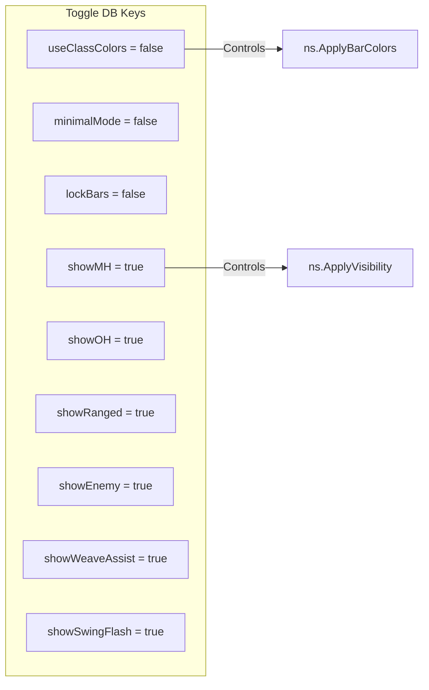
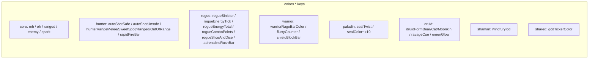

# DB Migration Changelog (`SuperSwingTimerDB.version`)

Source: `SuperSwingTimer.lua:180–823`

Current version: **45** (as of v0.0.10)

## Version timeline

```mermaid
timeline
    title SuperSwingTimerDB Migration History
    v2→3 : Initial color state migration
    v3→5 : Bar texture selection
    v5→6 : Spark texture & sizing
    v6→7 : Texture layers, alpha, minimal mode, lock
    v7→8 : Weave spark + dual triangle markers
    v8→9 : Visible default colors for fresh installs
    v9→10 : Restore dark gray bar palette
    v10→11 : Per-family weave toggles + compact markers
    v11→12 : Indicator glow + class color toggle
    v12→13 : Separate ranged texture
    v13→14 : Seal twist opaque black line
    v14→15 : Spark browser defaults + WA textures
    v15→16 : Compact spark & weave sizes
    v16→17 : Spark 4px base width
    v17→18 : Spark 4px re-duplicate
    v18→19 : Configurable border size
    v19→20 : Bar background & border colors
    v20→21 : Black default colors (bump)
    v21→22 : Enforce white spark + black bars + useClassColors=false
    v22→23 : Final release bump
    v24→25 : Enemy bar defaults + spark 3px
    v25→26 : Auto Shot safe/unsafe colors
    v26→27 : Rogue Sinister Strike assist
    v27→28 : Slimmer bars + Rogue energy tick
    v28→29 : Soften Rogue SS cue alpha
    v29→30 : Rogue Slice and Dice
    v30→31 : Rogue total-energy battery color
    v31→32 : Rogue combo points
    v32→33 : Hunter vertical range helper
    v33→34 : Paladin seal twist → transparent red
    v34→35 : Per-seal color defaults
    v35→36 : Warrior rage bar
    v36→37 : Druid form colors
    v37→38 : Warrior Protection hide toggle
    v38→39 : Phase 1 quick wins
    v39→40 : Phase 2 class-specific defaults
    v40→41 : Shield Block + Ravage defaults
    v41→42 : Independent hunterCastBarHeight
    v42→43 : Per-class bar height sliders
    v43→44 : Druid Tiger's Fury + Faerie Fire badge toggles + druidEnergyTick color
    v44→45 : Druid Mangle debuff timer + Rip duration bar
```



## Migration chain (detailed)

| Version | Description | Keys added |
|---------|-------------|-----------|
| **v2→3** | Initial color state migration | `colors.*` keys from `ns.DB_DEFAULTS.colors` |
| **v3→5** | Bar texture selection | `barTexture` |
| **v5→6** | Spark texture & sizing | `sparkTexture`, `weaveMarkerLayer`, `sparkWidth`, `sparkHeight` |
| **v6→7** | Texture layers, alpha, QoL | `barTextureLayer`, `sparkTextureLayer`, `barBackgroundAlpha`, `sparkAlpha`, `minimalMode`, `lockBars` |
| **v7→8** | Weave spark + dual triangle markers | `weaveSparkTexture/Layer/Width/Height/Alpha`, `weaveTriangleTop/Bottom/Layer/Size/Gap/Alpha` |
| **v8→9** | Visible default bar colors for fresh installs | Overwrites black `{0,0,0,1}` colors with `ns.DB_DEFAULTS.colors.*` |
| **v9→10** | Restore dark gray bar palette | `colors.mh/oh/ranged` → `{0,0,0,1}` if still default |
| **v10→11** | Smaller weave markers + per-family toggles | `weaveSparkWidth/Height/TriangleSize/Gap` slimmed, `weaveSpellFamilies.*` per-family defaults |
| **v11→12** | Indicator glow mode + class color toggle | `useClassColors` (default true→changed to false at v22), `indicatorBlendMode` |
| **v12→13** | Separate ranged texture | `rangedBarTexture` |
| **v13→14** | Seal twist opaque black line | `colors.sealTwist` → `{0,0,0,1}` from translucent blue |
| **v14→15** | Spark browser defaults + WA textures | `sparkTexture` → `Square_FullWhite`, `weaveSparkTexture` → `Square_FullWhite`, `sparkColor` structured with alpha |
| **v15→16** | Compact spark/weave sizes | `sparkWidth→4`, `sparkHeight→24`, `weaveSparkWidth→6`, `weaveSparkHeight→16`, `weaveTriangleSize→8` |
| **v16→17** | Spark base width 4px | `sparkWidth→4` |
| **v17→18** | Spark width 4px (re-duplicate) | Same as v17 for installs that missed it |
| **v18→19** | Configurable border size | `barBorderSize` |
| **v19→20** | Bar background/border colors | `barBackgroundColor`, `barBorderColor`, `barBackgroundAlpha` |
| **v20→21** | Black default colors | Version bump only (v21 just increments) |
| **v21→22** | Enforce white spark + black bars + `useClassColors=false` | `colors.mh/oh/ranged` reset to black, `sparkColor` → `{1,1,1,1}`, `useClassColors=false` |
| **v22→23** | Final release line bump | (bump only) |
| **v22→24** | (another bump) | (bump only) |
| **v24→25** | Enemy bar defaults + spark 3px | `sparkWidth→3`, enemy bar DB keys |
| **v25→26** | Auto Shot safe/unsafe colors | `colors.autoShotSafe`, `colors.autoShotUnsafe` |
| **v26→27** | Rogue Sinister Strike assist | `showRogueSinisterAssist` (default true), `colors.rogueSinister` |
| **v27→28** | Slimmer bars + Rogue energy tick | `barHeight→15`, `sparkHeight→15`, `showRogueEnergyTick` (default true), `colors.rogueEnergyTick` |
| **v28→29** | Soften Rogue SS cue alpha | Alpha changed from `0.45` → default |
| **v29→30** | Rogue Slice and Dice | `showRogueSliceAndDice` (default true), `colors.rogueSliceAndDice` |
| **v30→31** | Rogue total-energy battery color | `colors.rogueEnergyTotal` |
| **v31→32** | Rogue combo points | `showRogueComboPoints` (default true), `colors.rogueComboPoints` |
| **v32→33** | Hunter vertical range helper | `showHunterRangeHelper` (default true), `colors.hunterRangeMelee/SweetSpot/Ranged/OutOfRange` |
| **v33→34** | Paladin seal twist transparent red | `colors.sealTwist` → `{1,0,0,0.35}` (was opaque black) |
| **v34→35** | Per-seal color defaults | `colors.sealColor<FamilyKey>` for all `ns.PALADIN_SEAL_COLORS` |
| **v35→36** | Warrior rage bar | `showWarriorRageBar` (default true), `colors.warriorRageBarColor` → `{0.80,0.20,0.10,0.85}` |
| **v36→37** | Druid form colors | `showDruidFormColors` (default true), `colors.druidFormBear/Cat/Moonkin` |
| **v37→38** | Warrior Protection hide | `showWarriorRageProtection` (default false) |
| **v38→39** | Phase 1 quick wins | `showSwingFlash` (true), `showGcdTicker` (true), `showDruidRageDim` (true), `showRogueEnergyCountdown` (true), `colors.gcdTickerColor` |
| **v39→40** | Phase 2 class-specific defaults | `showHunterRapidFireBar`, `showWarriorFlurryCounter`, `showRogueAdrenalineRushBar`, `showDruidOmenGlow`, `showShamanWindfuryIcd`, `showWarriorShieldBlockBar`, `showDruidRavageCue` (all true), plus 5 color keys |
| **v40→41** | Shield Block + Ravage defaults | `colors.shieldBlockBar`, `colors.ravageCue` |
| **v41→42** | Independent hunterCastBarHeight | `hunterCastBarHeight` (default 10) |
| **v42→43** | Per-class bar height/width sliders | `rogueSliceAndDiceBarHeight` (4), `rogueEnergyTickBarWidth` (4), `warriorShieldBlockBarHeight` (4), `hunterRangeHelperWidth` (7), `hunterRapidFireBarHeight` (4), `druidPowerShiftBarHeight` (4), `druidEnergyTickBarWidth` (4), `rogueAdrenalineRushBarHeight` (4) |
| **v43→44** | Druid Tiger's Fury + Faerie Fire badges + druidEnergyTick color | `colors.druidEnergyTick`, `showDruidTigerFuryBadge` (true), `showDruidFaerieFireBadge` (true) |
| **v44→45** | Druid Mangle debuff timer + Rip tracker | `colors.druidMangleTimer`, `colors.druidRipTracker`, `showDruidMangleTimer` (true), `showDruidRipTracker` (true) |

## DB key categories

### Booleans (toggle defaults)



| Key | Default | Added |
|-----|---------|-------|
| `useClassColors` | false (v22+) | v12 |
| `minimalMode` | false | v7 |
| `lockBars` | false | v7 |
| `showMH` | true | v25 |
| `showOH` | true | v25 |
| `showRanged` | true | v25 |
| `showHunterRangeHelper` | true | v33 |
| `showHunterRapidFireBar` | true | v40 |
| `showEnemy` | true | v25 |
| `showWeaveAssist` | true | v25 |
| `showShamanWindfuryIcd` | true | v40 |
| `showRogueSinisterAssist` | true | v27 |
| `showRogueEnergyTick` | true | v28 |
| `showRogueSliceAndDice` | true | v30 |
| `showRogueComboPoints` | true | v32 |
| `showRogueAdrenalineRushBar` | true | v40 |
| `showWarriorFlurryCounter` | true | v40 |
| `showDruidOmenGlow` | true | v40 (legacy — Druid streamlining v0.0.9 stripped handler) |
| `showSwingFlash` | true | v39 |
| `showGcdTicker` | true | v39 |
| `showDruidRageDim` | true | v39 (legacy — Druid streamlining v0.0.9 stripped handler) |
| `showRogueEnergyCountdown` | true | v39 |
| `showWarriorRageBar` | true | v36 |
| `showWarriorRageProtection` | false | v38 |
| `showWarriorShieldBlockBar` | true | v40 |
| `showDruidRavageCue` | true | v40 (legacy — Druid streamlining v0.0.9 stripped handler; set to nil) |
| `showDruidPowerShiftBar` | true | v43 (legacy — Druid streamlining v0.0.9 stripped handler) |
| `showDruidEnergyTickBar` | true | v43 (legacy — Druid streamlining v0.0.9 stripped handler) |
| `showDruidFormColors` | true | v37 (legacy — Druid streamlining v0.0.9 stripped handler) |
| `showPaladinSealColor` | true | v34 |
| `showPaladinSealLabel` | true | v34 |
| `showPaladinJudgementMarker` | true | v34 |
| `showPaladinTwistFlash` | true | v34 |

### Numeric keys

| Key | Default | Range |
|-----|---------|-------|
| `barWidth` | 240 | 100–400 |
| `barHeight` | 15 | 10–40 |
| `hunterCastBarHeight` | 10 | 4–30 |
| `sparkWidth` | 3 | 2–60 |
| `sparkHeight` | 15 | 2–90 |
| `sparkAlpha` | 1.0 | 0–1 |
| `barBackgroundAlpha` | 0.5 | 0–1 |
| `barBorderSize` | 0 | 0–6 |
| `weaveSparkWidth` | 6 | 2–60 |
| `weaveSparkHeight` | 16 | 2–100 |
| `weaveSparkAlpha` | 1.0 | 0–1 |
| `weaveTriangleSize` | 8 | 6–24 |
| `weaveTriangleGap` | 2 | 0–6 |
| `weaveTriangleAlpha` | 1.0 | 0–1 |
| `rogueSliceAndDiceBarHeight` | 4 | 2–10 |
| `rogueEnergyTickBarWidth` | 4 | 2–20 |
| `warriorShieldBlockBarHeight` | 4 | 2–20 |
| `hunterRangeHelperWidth` | 7 | 2–60 |
| `hunterRapidFireBarHeight` | 4 | 2–20 |
| `druidPowerShiftBarHeight` | 4 | 2–20 |
| `druidEnergyTickBarWidth` | 4 | 2–20 |
| `rogueAdrenalineRushBarHeight` | 4 | 2–20 |

### Texture keys

| Key | Default |
|-----|---------|
| `barTexture` | `"Interface\\TargetingFrame\\UI-StatusBar"` |
| `barTextureLayer` | `"ARTWORK"` |
| `rangedBarTexture` | (same as barTexture) |
| `sparkTexture` | `"Interface\\CastingBar\\UI-CastingBar-Spark"` (v15+: `"Interface\\AddOns\\WeakAuras\\Media\\Textures\\Square_FullWhite.tga"`) |
| `sparkTextureLayer` | `"OVERLAY"` |
| `sparkColor` | `{r=1,g=1,b=1,a=1}` |
| `weaveSparkTexture` | WA Square_FullWhite |
| `weaveSparkTextureLayer` | `"OVERLAY"` |
| `weaveTriangleTopTexture` | WA Square_FullWhite |
| `weaveTriangleBottomTexture` | WA Square_FullWhite |
| `weaveTriangleTextureLayer` | `"OVERLAY"` |
| `weaveMarkerLayer` | `"OVERLAY"` |

### Weave spell family defaults

All `true` by default:
- `weaveSpellFamilies.LB` (Lightning Bolt)
- `weaveSpellFamilies.CL` (Chain Lightning)
- `weaveSpellFamilies.HW` (Healing Wave)
- `weaveSpellFamilies.LHW` (Lesser Healing Wave)
- `weaveSpellFamilies.CH` (Chain Heal)

### Color key reference (30+ keys in `colors.*`)



Full list: `mh`, `oh`, `ranged`, `enemy`, `spark`, `sealTwist`, `autoShotSafe`, `autoShotUnsafe`, `rogueSinister`, `rogueEnergyTick`, `rogueEnergyTotal`, `rogueComboPoints`, `rogueSliceAndDice`, `hunterRangeMelee`, `hunterRangeSweetSpot`, `hunterRangeRanged`, `hunterRangeOutOfRange`, `gcdTickerColor`, `warriorRageBarColor`, `druidFormBear`, `druidFormCat`, `druidFormMoonkin`, `rapidFireBar`, `flurryCounter`, `adrenalineRushBar`, `omenGlow`, `windfuryIcd`, `shieldBlockBar`, `ravageCue`, `sealColorCommand`, `sealColorBlood`, `sealColorMartyr`, `sealColorVengeance`, `sealColorRighteousness`, `sealColorCrusader`, `sealColorJustice`, `sealColorWisdom`, `sealColorLight`, `sealColorCorruption`.

### Position defaults

```lua
positions = {
  mh     = { point="CENTER", relativePoint="CENTER", x=-80, y=-100 },
  oh     = { point="CENTER", relativePoint="CENTER", x=80, y=-100 },
  ranged = { point="CENTER", relativePoint="CENTER", x=0, y=0 },
  enemy  = { point="CENTER", relativePoint="CENTER", x=0, y=120 },
}

---
**🔄 Sync hook:** If `ns.db.version` bumps or DB defaults/keys change in the migration chain, update this file. Master protocol → `standards/code.md`
