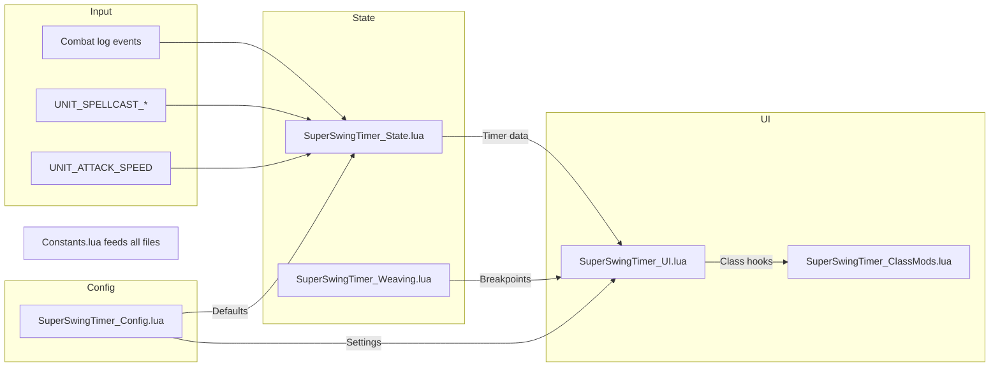

# Code Standards — Super Swing Timer

> **Source:** `AGENTS.md` file map + working rules. Read `AGENTS.md` before editing.

## MUST rules

- **MUST** use `ns.GetAlignedTime()` (canonical precision clock in Constants.lua) or the local `GetCurrentTime()` helper that delegates to it, for all swing timing. DO NOT call `ns.GetCurrentTime()` — that function does NOT exist.
- **MUST** keep swing-timer logic on `OnUpdate`; `C_Timer` only for one-shot/low-freq delays
- **MUST** apply latency (`GetNetStats()`) only to predictive windows, never to live swing anchors
- **MUST** verify WoW Classic API before using Retail-only functions
- **MUST** use `ns.GetSpellInfo` wrapper (not bare `GetSpellInfo`) for cross-version safety
- **MUST** update ALL 6 LOCATIONS when adding a setting (per AGENTS.md): `ns.DB_DEFAULTS` → SavedVariables migration (`SuperSwingTimer.lua`) → runtime apply fn (`_UI.lua`) → config-panel controls (`_Config.lua`) → README → TOC. The 7 `.lua` source files are the full codebase; the 6 locations are the change checklist.
- **MUST** keep class-specific behavior in `SuperSwingTimer_ClassMods.lua` only
- **MUST** fix LSP errors as they appear (auto-shown on edit) — zero diagnostics before committing

## SHOULD rules

- **SHOULD** keep `SuperSwingTimer.lua` as bootstrap-only (no feature logic)
- **SHOULD** keep shaman weave math in `SuperSwingTimer_Weaving.lua` (not in state engine)
- **SHOULD** use `select()` or `_` placeholders for unused CLEU return values
- **SHOULD** preserve current defaults unless change is explicitly requested
- **SHOULD** prefer built-in WoW texture paths over packaged media
- **SHOULD** use `SetDrawLayer("OVERLAY", 0)` for overlay textures (not shared shaman path)

## DO NOT touch
- `docs/spellIds.md` — reference only, generated by separate process
- SavedVariables migration versions already shipped (v30-v34) — only append, never modify
- `memory-bank/` files without reading them first

## Rule files for this task
When editing code, also load the matching `rules/subsystem/*.md` for the file you're changing:
- `_State.lua` / `_Weaving.lua` → `rules/subsystem/state-timing.md`
- `_UI.lua` / `_Config.lua` → `rules/subsystem/ui-visibility.md`
- `_ClassMods.lua` → `rules/subsystem/class-behavior.md` (+ optional `rules/class/*.md`)
- `SuperSwingTimer.lua` → `rules/subsystem/bootstrap-migration.md`

## Architecture — data flow



## Architecture — file roles
- **State** (`_State.lua`): timer math, combat-log interpretation, swing rescaling — NO frame creation
- **UI** (`_UI.lua`): frame creation, texture application, OnUpdate rendering — NO timer math
- **ClassMods** (`_ClassMods.lua`): per-class overlays — never modifies core state
- **Weaving** (`_Weaving.lua`): breakpoint math only — owns no swing state
- **Constants** (`_Constants.lua`): spell IDs, defaults, static data — imported by all files

## Commands (maintain this list)
- `git log --oneline -10` — check recent history before committing

## Key file index (auto-read before editing)
Weighted index of critical files that MUST be read before certain actions.
Full index in `workflows/sync.md` (Section 2). Abbreviated here:

| Weight | File | When to read |
|--------|------|-------------|
| 1.0 | `AGENTS.md` | Session start, before any edit |
| 1.0 | `standards/code.md` (this file) | Session start, context compaction |
| 0.9 | `context/index.md` | Session start, path verification |
| 0.8 | `references/core-timing.md` | Before editing State/Constants/Weaving |
| 0.8 | `references/db-migrations.md` | Before editing Config/Bootstrap/Constants |
| 0.8 | `references/config-panel.md` | Before editing Config |
| 0.8 | `references/classmods-helpers.md` | Before editing ClassMods |

## Session rules (anti-decay)
- **Re-read files** that were modified during this session if they become relevant again
- **Keep failures visible** — don't clean away failed compilation or test output; they help the model recover
- **Recite goals** — if context grows long, rewrite current goals/progress to a scratch note to stay focused
- **Context compaction recovery** — after compaction, re-read key-file index (weights ≥ 0.8) + `AGENTS.md` + current task document

## ⚠️  Master sync protocol — read before every edit session, run before every commit

All `.opencode/` files are YOUR reference contract. **They must match the actual source code at all times.** When they drift, the agent produces wrong code — worse than no context at all.

Every `.opencode/` file has a one-liner footer: `🔄 Sync hook: ... Master protocol → standards/code.md`. That points HERE. This is THE authoritative single source of truth for what to update after what code change.

### What to update after what code change

| You edit → | Update these `.opencode/` files |
|------------|--------------------------------|
| **Timing constants** (ns.CAST_WINDOW, LATENCY_REFRESH_INTERVAL, etc.) | `references/core-timing.md` + `rules/class/*.md` for affected classes + `rules/subsystem/state-timing.md` |
| **DB defaults / keys** (ns.DB_DEFAULTS, migration versions) | `references/db-migrations.md` + `references/config-panel.md` + `rules/subsystem/ui-visibility.md` + `rules/subsystem/bootstrap-migration.md` |
| **Class helpers** (badges, bars, timers, callbacks) | `references/classmods-helpers.md` + `rules/class/<class>.md` + `rules/subsystem/class-behavior.md` |
| **MUST/SHOULD rules** (new patterns, new constraints) | `standards/code.md` + `rules/lua-code.md` (if Lua-wide) |
| **File architecture** (new files, changed responsibilities) | `rules/general.md` architecture section + `standards/code.md` architecture diagram + `index.md` |
| **README / CHANGELOG format** | `standards/docs.md` + `rules/documentation.md` |
| **New failure mode discovered** | `standards/tests.md` known failure modes table + `workflows/review.md` checklist |
| **File added/removed** | `index.md` + `rules/general.md` file roles table + `standards/code.md` architecture |
| **Review workflow changed** | `workflows/review.md` |
| **Delegation pattern changed** | `workflows/delegation.md` |

### Auto-decay checklist (mandatory before every commit)

```
[ ] Did I change timing constants?     → Update core-timing.md + class files
[ ] Did I change DB keys?              → Update db-migrations.md + config-panel.md
[ ] Did I change class helpers?        → Update classmods-helpers.md + class files
[ ] Did I discover a new bug pattern?  → Update tests.md failure modes table
[ ] Did I change file roles?           → Update index.md + general.md + code.md
[ ] Did I change docs format?          → Update docs.md + documentation.md
[ ] Did I add/remove files?            → Update index.md + code.md architecture
[ ] Did I edit a class file?           → Update the matching rules/class/<class>.md
[ ] Did I edit state/weaving?          → Update rules/subsystem/state-timing.md
[ ] Did I edit UI/config?              → Update rules/subsystem/ui-visibility.md
[ ] Did I edit ClassMods?              → Update rules/subsystem/class-behavior.md
[ ] Did I edit SuperSwingTimer.lua?    → Update rules/subsystem/bootstrap-migration.md
```

### If you find a context file is stale
1. **STOP** — don't continue coding with inaccurate context
2. Classify the drift (see `workflows/sync.md` Section 3.1):
   - **Mechanical** (wrong line numbers, versions) → auto-fix
   - **Content** (timing constants, behavior) → propose fix
   - **Ambiguous** (intent unclear) → escalate to human
3. Fix the stale file to match the actual code
4. Then proceed with the edit task
5. Commit context updates alongside code changes (never separately — they must travel together)

### Quality gates (summary)
Before every commit, run through `workflows/quality-gates.md`:
- Layer 1a: Formatting ✅ (auto-fix)
- Layer 1b: Secrets ✅ (scan)
- Layer 1c: Diff-size ✅ (check)
- Layer 2a: LSP Diagnostics ✅ (run — MUST pass)
- Layer 2b: Type check ✅ (run)
- Layer 3: Tests ✅ (run — MUST pass)
- Layer 4a: AI Review ✅ (run if complex)
- Layer 4b: Human Review ✅ (required for merge)

### Full workflow stack
This project uses a layered workflow system. When starting a task, reference:
1. `workflows/planning.md` — Decompose complex work into subtasks
2. `workflows/sync.md` — Load context, verify no drift, sync on completion
3. `workflows/quality-gates.md` — Verify quality at every stage
4. `workflows/review.md` — Code review with parallel agents
5. `workflows/delegation.md` — Delegate with structured handoffs (if needed)

---
**🔄 Sync hook:** If MUST/SHOULD rules, architecture diagram, file roles, key file index, or master sync protocol table change, update this file. Master protocol is this file.
