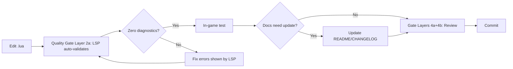

# Testing Standards — Super Swing Timer

> **Current:** LSP-only (v0.0.8 = clean diagnostics on all 7 .lua files). Formal test suite = Phase 10 on roadmap.
> **Config:** `.luacheckrc` at project root — uses `lua51+min` std, defines WoW globals, `max_line_length=260`.

## Pre-submit pipeline

**Note:** This is part of the full quality gates stack (`workflows/quality-gates.md`). LSP is Layer 2a — diagnostics auto-show on edit, fix before moving on.

## Pre-submit checklist
- [ ] **MUST** fix LSP diagnostics as they appear (auto-shown on edit)
- [ ] **MUST** fix zero diagnostics (no warnings, no errors)
- [ ] **MUST** check for: undefined globals, missing `end`, bare `local` before `ns` init
- [ ] **MUST** verify OnUpdate closures capture references correctly (no `prevOnUpdate` chain bugs)
- [ ] **SHOULD** test in-game on Classic/TBC Anniversary client
- [ ] **SHOULD** verify: bars appear in combat, hide out of combat, config panel opens

## Known failure modes (from v0.0.8)
| Failure | Root cause | Prevention |
|---------|-----------|------------|
| Non-hunter classes silently broken | Bare `local` before `ns` declaration | Always declare locals after `ns = ...` |
| LSP cascade errors | Missing `end` statement | Count block-ending `end` vs opening blocks |
| OnUpdate chain breaks | `prevOnUpdate` as undefined global | Capture `ns.OnUpdate` directly |
| `strtrim` nil error | Missing `rawget` import | Import via `rawget(_G, "strtrim")` |

---
**🔄 Sync hook:** Add new failure modes here as they're discovered. Update command/config descriptions if `.luacheckrc` or test tools change. If testing pipeline (layers, order, commands) changes, update `workflows/quality-gates.md`. Master protocol → `standards/code.md`

