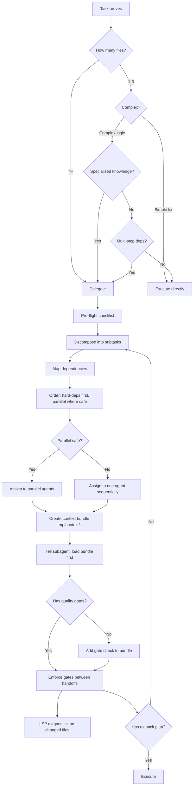
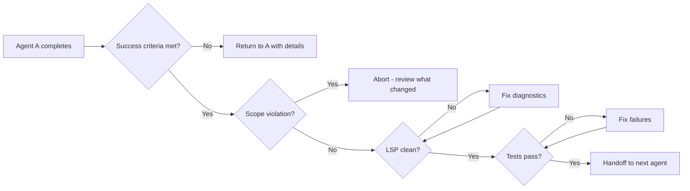

# Delegation Workflow — Super Swing Timer

> **Purpose:** Route tasks to the right executor with full context, structured handoffs, and verification gates between every phase.

## Decision flow



---

## 1. DELEGATE VS EXECUTE

| Delegate when... | Execute directly when... |
|-----------------|------------------------|
| 4+ files need changes | Single file, simple change |
| Specialized knowledge (Hunter/Shaman math) | Clear bug fix, known root cause |
| Multi-component review needed | Straightforward enhancement |
| Multi-step dependencies (new setting across 6 files) | |
| Fresh eyes / alternative approach needed | |
| Task fits task decomposition patterns | |

---

## 2. BEFORE DELEGATING

### 2.1 Pre-flight checklist
Before ANY delegation, verify ALL of these:

```
[ ] Clear objective — one sentence the subagent can repeat back
[ ] Exact file list — every file the subagent may touch, no more
[ ] Success criteria — verifiable conditions, not aspirations ("bars appear in combat" ✓ vs "better UI" ✗)
[ ] Out of scope — explicit WHAT NOT TO DO (prevents scope creep)
[ ] Context bundle created at .tmp/context/{session-id}/bundle.md
[ ] All context files loaded into YOUR context before delegating
[ ] Time estimate — expected completion time
[ ] Rollback plan — what to do if delegation fails
```

### 2.2 Verify yourself first
1. **Load** the relevant standards file (code/docs/tests/review) into your own context
2. **Verify** the task is well-scoped per `workflows/planning.md` — clear success criteria, explicit file boundaries
3. **Check** no conflict with any agent already running (file locking)
4. **Decide** parallel vs sequential based on dependency graph
5. **Estimate** expected completion time — set a timeout
6. **Plan** the rollback — know which files to revert if delegation fails

### 2.3 Create context bundle
Create `.tmp/context/{session-id}/bundle.md` with:

````markdown
# Context Bundle: {task-name}

**Project:** Super Swing Timer — WoW Classic/TBC addon (Lua), v0.0.8
**Namespace:** `ns` in global `SuperSwingTimer` table
**SavedVariables:** `SuperSwingTimerDB` (legacy: `SwangThangDB`, `HunterTimerDB`)

## Loaded standards
{insert applicable content from code.md / docs.md / tests.md etc.}

## Task (from planning.md)
### Objective
{one sentence}

### Files
| File | Action | Notes |
|------|--------|-------|
| path | modify | what to change |

### Success criteria
- [ ] {verifiable condition}

### Out of scope
- {what NOT to touch}

## Constraints
- {must follow project conventions}
- {must pass LSP diagnostics (auto-shown on edit)}
- {do NOT touch files outside scope}

## Quality gates (from quality-gates.md)
- Layer 2a: LSP Diagnostics — MUST pass before returning
- Layer 3: Tests — MUST pass before returning
````

### 2.4 Time-bounding delegation
Every delegated task MUST have a timeout:

| Task size | Expected time | Hard timeout | Action on timeout |
|-----------|--------------|-------------|-------------------|
| Single file, simple | 1-2 min | 5 min | Revert, do directly |
| 2-3 files, moderate | 5-10 min | 15 min | Check progress, re-delegate |
| 4+ files, complex | 15-30 min | 45 min | Partial recovery (see §8) |
| Research/exploration | 3-5 min | 10 min | Accept partial results |

- **Hard timeout** = absolute max. If exceeded, abort and trigger rollback.
- **Progress checkpoints**: For tasks >10 min expected, request mid-way status at 50% of hard timeout.

---

## 3. STRUCTURED HANDOFF CONTRACTS

Every handoff between agents MUST follow this contract format.
This prevents the cascade of errors from one agent to the next.

### 3.1 Handoff contract template

```markdown
## HANDOFF: {From Agent} → {To Agent}

### Deliverable
{What the from-agent produced — file paths, data structures, interfaces}

### Contract
{What the to-agent must receive — function signatures, expected inputs, output format}

### Verification
- [ ] From-agent: all success criteria met
- [ ] From-agent: no files outside scope modified
- [ ] From-agent: LSP diagnostics clean
- [ ] Gate: tests pass on from-agent's output
[Only if gate passes → proceed to to-agent]

### Design decisions made
{Any decisions the from-agent made that the to-agent needs to know}

### Open questions
{Questions that arose during from-agent's work}
```

### 3.2 Handoff sequence patterns

| Pattern | Flow | When to use |
|---------|------|-------------|
| **Serial** | A → B → C → D | Hard dependencies between each step |
| **Fan-out** | A → B, A → C, A → D | A produces shared interface, B/C/D consume |
| **Fan-in** | A, B, C → D | D aggregates independent work from A/B/C |
| **Pipeline** | A → B, B → C, C → D | Sequential pipeline with intermediate artifacts |
| **Parallel** | A∥B∥C → D | Independent work, all consumed by D |

---

## 4. COORDINATION PATTERNS

### 4.1 File ownership isolation
```
✓ Every file assigned to exactly one agent
✓ If two agents need the same file → merge tasks or split differently
✓ Use git worktrees or branch-per-agent isolation for parallel agents
```

### 4.2 Shared interface contracts
When agents work in parallel on connected code:
```
1. Define the interface/signature BEFORE splitting
2. Each agent gets the contract but NOT the implementation
3. At merge point, verify implementations match the contract
4. If contract changes → all dependent agents are notified
```

### 4.3 Dependency gates
Between every handoff in a chain:
```
1. From-agent: "Task complete, output at {path}"
2. Orchestrator: Verifies success criteria + LSP + tests
3. Gate: PASS or FAIL
4. On FAIL: return to from-agent with error details
5. On PASS: hand off to to-agent with contract + output
```

### 4.4 Conflict resolution (when agents disagree)

| Disagreement type | Resolution |
|------------------|-----------|
| Implementation approach | Orchestrator decides based on project conventions |
| Interface design | Both agents return to orchestrator with proposals |
| File ownership overlap | Re-scope tasks, resolve overlap, retry |
| Priority dispute | Orchestrator sets priority based on dependency order |

---

## 5. VERIFICATION GATES BETWEEN AGENTS

Every handoff MUST pass through these gates. This is non-negotiable.

### 5.1 Gate sequence



### 5.2 Gate requirements per layer

| Gate | What to check | Tool/command |
|------|--------------|-------------|
| Success criteria | Task output matches declared success conditions | Manual verification |
| Scope | Only files in task scope were modified | `git diff --name-only` |
| LSP | Zero diagnostics on changed files | Auto-shown on edit |
| Tests | All tests pass | Manual sanity checks |
| Diff size | <500 lines/file, <2000/session | `git diff --stat` |
| Sync | Context files updated per master protocol | Auto-decay checklist |

---

## 6. SUBAGENT ROUTING (SPECIALIZED)

### 6.1 Subsystem rule mapping (for context bundles)
| Target file | Bundle also include |
|-------------|-------------------|
| `_State.lua`, `_Weaving.lua`, `_Constants.lua` | `rules/subsystem/state-timing.md` |
| `_UI.lua`, `_Config.lua` | `rules/subsystem/ui-visibility.md` |
| `_ClassMods.lua` | `rules/subsystem/class-behavior.md` + matching `rules/class/*.md` |
| `SuperSwingTimer.lua` | `rules/subsystem/bootstrap-migration.md` |

### 6.2 Multi-agent routing

For complex multi-step features, use subagent roles:

| Role | When to use | Agent type |
|------|-------------|-----------|
| **Planner** | Task needs decomposition into subtasks | `task-manager` skill |
| **Implementer** | Writing code changes | `coder` or `build` |
| **Verifier** | Checking output matches spec | `reviewer` or `oracle` |
| **QA** | Running tests, verifying edge cases | `Tester` |

---

## 7. AFTER DELEGATION

1. **Verify** output against `workflows/review.md` checklist
2. **Run** quality gates per `workflows/quality-gates.md`
3. **Check** no drift in context files — run auto-decay checklist
4. **Update** `AGENTS.md` "Current progress" if significant
5. **Clean up** `.tmp/context/{session-id}/` bundle on confirmation
6. **Log** what worked and what didn't for future delegation decisions

---

## 8. RECOVERY & FAILURE HANDLING

### 8.1 Failure mode decision tree

```
Delegated task fails or times out
     ↓
Was it a timeout? ──Yes──→ Hard timeout exceeded?
                               ↓
                          Yes ←→ No
                           ↓      ↓
                    Revert all    Check progress
                    changes       (any output?)
                       ↓              ↓
                    Do directly  Has usable output?
                       ↓          Yes ←→ No
                    Done          ↓      ↓
                              Accept    Revert
                              partial   changes
                                ↓       ↓
                            Finish    Do directly
                            remaining
```

### 8.2 Failure type → recovery strategy

| Failure type | Symptom | Recovery |
|-------------|---------|----------|
| **Timeout** | Hard timeout exceeded | Revert all changes from that agent. Do task directly. |
| **Scope creep** | Agent modified files outside scope | Abort. Revert unapproved files. Re-scope task. |
| **Wrong approach** | Output doesn't match success criteria | Revert. Write more specific prompt. Re-delegate with stricter constraints. |
| **Partial success** | Some subtasks OK, some failed | Accept working output. Re-delegate remaining subtasks. |
| **Cascade failure** | Agent A failure breaks Agent B dependency | Revert B (dependent on A). Fix A first. Re-delegate B after A passes. |
| **LSP errors** | Diagnostics not clean on return | Return to agent with error list. If 3 strikes → do directly. |
| **Misunderstanding** | Output is technically correct but conceptually wrong | Abort delegation. Do directly yourself — conceptual failures cannot be fixed by re-prompting. |

### 8.3 Partial-success recovery (fan-out / parallel)

When multiple parallel agents run and some fail:

```
1. Identify which agents passed and which failed
2. Accept passing agents' output (verify individually)
3. For failed agents:
   a. If independent of passing agents → re-delegate just the failed subtask
   b. If dependent on passing agents → check if dependency still valid
4. Merge passing output + re-delegated subtask output
5. Never re-run passing agents just because one failed
```

### 8.4 Rollback plan template

Before delegating any multi-file task, declare:

```markdown
## Rollback plan
- Files this agent may touch: {list}
- If agent fails: `git checkout -- {all touched files}`
- If agent partially succeeds: accept {specific files}, revert {specific files}
- If agent times out: `git checkout -- {all touched files}`, do directly
```

### 8.5 Re-delegation vs direct execution

After a failed delegation, decide:

```
Failed delegation
     ↓
Was the prompt clear and specific? ──No──→ Rewrite prompt, re-delegate
     ↓
Yes
     ↓
Was the task genuinely complex? ──Yes──→ Re-delegate with stricter constraints
     ↓
No
     ↓
Do it directly — delegation overhead exceeded the task complexity
```

---

## 9. CONTEXT TRACKING & AUDIT

### 9.1 What to log per delegation

Create `.tmp/delegation-log/{session-id}.md` for each delegation session:

```markdown
# Delegation Log: {task-name}
**Date:** {timestamp}
**Subagent:** {agent type}
**Expected time:** {estimate}  **Actual time:** {actual}

## Result
- [ ] All success criteria met
- [ ] Partial success ({n}/{m} criteria)
- [ ] Failed

## Time
- Expected: {estimate}
- Actual: {actual}
- Timeout: {hard limit}

## Files changed
{git diff --name-only output}

## Lessons
- What worked: {pattern to repeat}
- What didn't: {pattern to avoid}
- Prompt improvement: {how to write the prompt better next time}
```

### 9.2 Context bundle versioning
- Bundle files are created at `.tmp/context/{session-id}/bundle.md`
- The `{session-id}` links the bundle to the delegation session
- On completion/failure, the bundle stays until confirmed cleanup
- This preserves a full audit trail of what context the agent received

---

**🔄 Sync hook:** If delegation patterns, context bundle structure, subagent routing, handoff contracts, coordination patterns, recovery strategies, or audit logging change, update this file. Master protocol → `standards/code.md`
