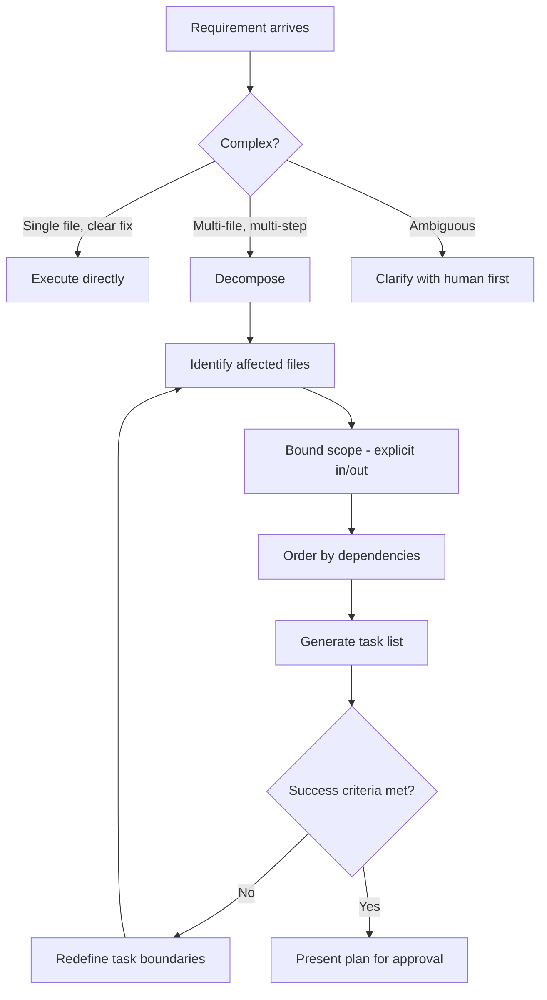

# Task Decomposition & Planning — Super Swing Timer

> **Purpose:** Break complex work into atomic, verifiable units before executing. 
> Every task must have clear success criteria, file boundaries, and a single owner.

## Core principle

Task decomposition is the highest-leverage skill in agentic development. 
Getting it right prevents conflicts before they happen. Getting it wrong creates problems no merge tool can fix.

**Rule:** If a task feels too complex, decompose it further. The goal is atomic units that a single agent pass can handle completely.

---

## 1. DECOMPOSITION FRAMEWORK

### 1.1 Task structure

Every task MUST have:

```
ID:          Unique identifier (e.g., `TASK-003`)
Title:       Short action-oriented description
Scope:       Which files are in play / off-limits
Depends on:  Task IDs that must complete first
Success:     Verifiable condition (test passes, file has expected content)
Risk:        Low / Medium / High
Model:       Which model tier to use (if multi-model routing)
```

### 1.2 Atomicity criteria

A task is "atomic enough" when:

```
✓ A single agent can execute it in one pass
✓ Success can be verified programmatically
✓ It doesn't require coordination with another in-flight agent
✓ It touches at most 3 files (unless bulk refactor)
✓ It can be described in 1-2 sentences
```

### 1.3 Decomposition patterns

| Pattern | When to use | Example |
|---------|------------|---------|
| **By file** | New feature touches multiple independent files | `Constants.lua` (add keys) separately from `Config.lua` (add controls) |
| **By layer** | Change propagates through stack | First: DB defaults + migration. Then: apply function. Then: UI controls |
| **By concern** | Cross-cutting change | All Hunter-related changes vs all Warrior-related changes |
| **By verification** | Hard to verify all at once | First: implementation. Then: tests. Then: docs |
| **Dependency-first** | Tasks depend on each other | Always complete DB schema before data access before UI |

---

## 2. PLANNING WORKFLOW



### 2.1 Step-by-step

**Step 1: Identify affected files**
- List every file that will change
- Classify each: add-only, modify, delete, create
- Check: does any single file appear in two tasks? If yes → merge or split

**Step 2: Bound scope**
- Explicitly state what's IN and what's OUT
- OUT is as important as IN — prevents scope creep

```
IN:  Constants.lua (add new spell IDs), ClassMods.lua (add helper bar)
OUT: State.lua (no timer math changes), UI.lua (no bar creation changes)
```

**Step 3: Order by dependencies**
- Task A must finish before Task B starts → dependency
- Tasks with no dependencies → can run in parallel
- Visualize with: `A → B, A → C, B → D, C → D` (D depends on both B and C)

**Step 4: Generate task list with success criteria**
```
Task 1: Add spell IDs to Constants.lua
  Files: Constants.lua
  Success: `grep "MY_NEW_ID" Constants.lua` returns match
  Depends: none

Task 2: Add helper bar to ClassMods.lua
  Files: ClassMods.lua
  Success: Helper bar visible in-game on class X
  Depends: Task 1

Task 3: Wire toggle in Config.lua
  Files: Config.lua
  Success: Toggle appears in /sst panel
  Depends: Task 1
```

---

## 3. DEPENDENCY MANAGEMENT

### 3.1 Dependency types

| Type | Meaning | Parallel? |
|------|---------|-----------|
| **Hard** | B cannot compile/run without A | No — sequential |
| **Soft** | B benefits from A's output but can start independently | Yes — parallel, merge sequence matters |
| **Information** | B needs to know A's interface but not implementation | Yes — define interface contract first |
| **Resource** | B needs the same resource as A (file, config, DB) | No — exclusive lock |

### 3.2 Parallel execution rules

```
✓ Tasks with no dependency chain → execute in parallel
✓ Tasks with only information deps → execute in parallel (contract-first)
✗ Tasks with hard deps on same file → sequential only
✗ Two agents editing the same file → NEVER (must merge into one task or split differently)
✗ More than 5 parallel agents → review bottleneck negates gains
```

### 3.3 Dependency visualization

```
# Simple dependency chain
T1[Add DB keys] --> T2[Migration] --> T3[Apply function] --> T4[Config control]

# Parallel with merge point
T1[Constants changes] --> T3[ClassMods helper]
T2[State timing changes] --> T3
                        T3 --> T4[UI wiring]
                        T3 --> T5[Config toggle]
```

---

## 4. VERIFICATION GATES BETWEEN TASKS

Between every task handoff, the following MUST pass before the next task starts:

### 4.1 After a dependency completes
```
✓ All files it modified exist and have valid content
✓ LSP diagnostics pass on its changed files
✓ No files outside its declared scope were modified
```

### 4.2 Before a dependent task starts
```
✓ Its dependencies are all marked complete
✓ All dependency outputs are available
✓ No scope overlap with other in-flight tasks
```

### 4.3 Kill criteria during planning
```
✓ Every task has a verifiable success condition (not "looks right")
✓ Every file appears in exactly one task's scope
✓ The plan completes in fewer than 8 sequential steps
    (More than 8 → something needs to be parallelized)
```

---

## 5. TASK TEMPLATE

Use this for every delegated or tracked task:

```markdown
## TASK-NNN: {Short title}

### Objective
{One sentence describing what this task accomplishes}

### Files
| File | Action | Notes |
|------|--------|-------|
| path/to/file.lua | modify | Add X to function Y |
| path/to/new.lua | create | New helper module |

### Dependencies
- [ ] TASK-00A (hard dependency)
- [ ] TASK-00B (information dependency)

### Success criteria
- [ ] Criterion 1 (programmatic: `grep` or LSP diagnostics)
- [ ] Criterion 2 (behavioral: visible in-game / setting works)

### Constraints
{Any constraints the executor must follow}

### Out of scope
{What this task explicitly does NOT do}
```

---

## 6. WORKLOAD BALANCING

### 6.1 Agent limits
```
Local parallel agents:  3-5 max
Cloud async agents:     unlimited (backlog)
Sequential chain depth: 8 max
Files per task:         3 max (non-refactor)
```

### 6.2 When to split

| Signal | Action |
|--------|--------|
| Task touches 4+ files | Split by layer or concern |
| Task exceeds 500 lines diff | Split into smaller milestones |
| Success criteria feels fuzzy | Add explicit verification conditions |
| Task requires 2+ domain experts | Split per expertise area |
| Estimated time > 30min agent work | Split into logical phases |

---

## 7. POST-EXECUTION PLAN REVIEW

After all tasks are complete:
```
1. Verify every task's success criteria passed
2. Run full test suite (no partial verification)
3. Check no files modified outside any task's scope
4. Run full diagnostics on all changed files
5. Verify the integrated result works end-to-end
```

---

**🔄 Sync hook:** If decomposition patterns, dependency management, task structure, or workload balance rules change, update this file. Master protocol → `standards/code.md`
