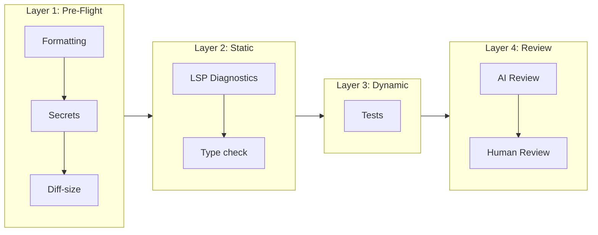
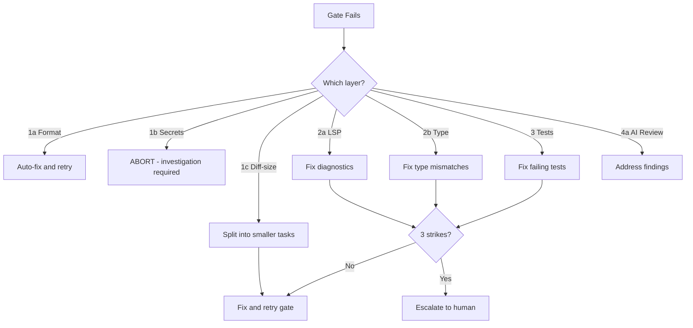

# Quality Gates — Super Swing Timer

> **Purpose:** Mandatory verification checkpoints that every change must pass before progressing to the next phase. Gate failures block advancement — they do not generate warnings.

## Architecture

Quality gates are layered checkpoints between every phase of an agent workflow. Each gate is:
- **Deterministic** — same input always produces same pass/fail
- **Ordered** — gates run in sequence, later gates depend on earlier ones passing
- **Non-negotiable** — no "skip if flaky" escape hatches

---

## 1. GATE LAYERS (run in order)



| Layer | Gate | What it catches | Time | Auto-fix? |
|-------|------|----------------|------|-----------|
| 1a | **Formatting** | Mixed indentation, trailing whitespace, bad line endings | <1s | ✅ Yes |
| 1b | **Secrets** | API keys, tokens, passwords in code | <1s | ❌ Block |
| 1c | **Diff-size** | Changes exceeding max lines (500/single file, 2000/session) | <1s | ❌ Block |
| 2a | **LSP Diagnostics** | Undefined globals, missing `end`, type errors, shadowed locals | <5s | ❌ Block |
| 2b | **Type check** | Interface mismatches, nil access, wrong return types | <10s | ❌ Block |
| 3 | **Tests** | Regressions, broken contracts, edge-case failures | <120s | ❌ Block |
| 4a | **AI Review** | Architectural issues, missing patterns, semantic drift | 30-90s | ⚠️ Proposal |
| 4b | **Human Review** | Design intent, business logic, unexpected changes | — | ✅ Required |

---

## 2. GATE DEFINITIONS

### 2.1 Layer 1a — Formatting gate
**When:** Before every write/edit tool call
**What:** Strip trailing whitespace, ensure consistent line endings, match project indent style
**Enforcement:** Auto-fix silently. If auto-fix fails (binary file, encoding issue), block and report.

```
✓ All files pass formatter
✓ No mixed tabs/spaces
✓ No trailing whitespace in committed files
```

### 2.2 Layer 1b — Secrets gate
**When:** PreToolUse on every write/create-file tool call
**What:** Scan content for API key patterns, tokens, credentials, connection strings

**Block patterns (fail instantly):**
- `sk-[a-zA-Z0-9]{20,}` (OpenAI keys)
- `api_key\s*=\s*['"][^'"]+['"]`
- `password\s*=\s*['"][^'"]+['"]`
- `token\s*=\s*['"][a-zA-Z0-9._-]{20,}['"]`
- `-----BEGIN (RSA|EC|OPENSSH) PRIVATE KEY-----`

**Action:** If detected → BLOCK the write → report which pattern matched → do NOT include the matched content in the report (leaking it into context defeats the purpose)

### 2.3 Layer 1c — Diff-size gate
**When:** Before commit or merge
**What:** Verify total changes stay within comprehensible limits

**Thresholds (project-specific):**
```
Max lines changed per single file:  500
Max lines changed per session:      2000
Max files changed per session:      20
```

**If exceeded:** The task was too large. Block. Suggest decomposition into smaller units.

### 2.4 Layer 2a — LSP Diagnostics gate (CRITICAL)
**When:** Every edit that touches `.lua` files — LSP auto-validates on save
**What:** Zero diagnostics required

```
Expected: LSP shows zero errors/warnings on the edited file
Failure:  LSP shows any diagnostic of any severity
```

**On failure:** BLOCK. Show diagnostics. Do not proceed until fixed.
**Three-strike rule:** If same file fails diagnostics 3 times in a row → abort session, the approach is wrong, not the implementation.

### 2.5 Layer 2b — Type check gate
**When:** After LSP gate passes, before tests
**What:** Verify type consistency across changed interfaces

**Checks:**
```
✓ Function signatures match call sites
✓ Return types match what callers expect  
✓ Global ns table entries initialized before use
✓ nil-safe access patterns (no bare global reads)
```

### 2.6 Layer 3 — Tests gate
**When:** All static gates pass
**What:** Run test suite. All tests must pass.

**For this project (Lua/Classic WoW addon):**
```
Primary:   LSP diagnostics → zero errors on edited files
Secondary: Manual sanity checks:
           ✓ Bars appear in combat
           ✓ Bars hide out of combat
           ✓ Config panel opens
           ✓ No Lua errors in-game
```

**Two-strike rule:** Failed tests after fix → abort, escalate to human. The fix path is wrong.

### 2.7 Layer 4a — AI Review gate
**When:** Before human review
**What:** Automated code review against architectural patterns

**Parallel review agents (run simultaneously):**
1. **Architecture agent** — checks: file placement, separation of concerns, cross-file consistency
2. **Pattern agent** — checks: existing convention usage, doesn't reinvent established patterns
3. **Security agent** — checks: no dangerous globals, no unsafe `loadstring`, API version safety

**Output:** Unified findings with severity. If any finding is `critical` → gate fails.

### 2.8 Layer 4b — Human Review gate (final)
**When:** All automated gates pass
**What:** Human reviews architecture, business logic, unexpected changes

**Human should focus on:**
- Does the solution actually solve the stated problem?
- Are there edge cases the agent missed?
- Did the agent change anything it wasn't asked to?
- Are the architectural decisions sound?

---

## 3. ENFORCEMENT

### 3.1 Gate failure escalation



### 3.2 Kill criteria (abort conditions)

| Condition | Action |
|-----------|--------|
| Same file fails LSP gate 3 consecutive times | Abort session, approach is wrong |
| Tests fail for 2 fix cycles | Abort, escalate to human |
| Agent touches files outside declared scope | Abort immediately, review what changed |
| Agent stuck 3+ iterations on same error | Abort, decompose further, reassign |
| Secrets gate triggers | ALWAYS abort (human must verify no leak occurred) |

### 3.3 Forgiveness policy (allowed skips)

| Gate | Skip allowed? | Reason |
|------|--------------|--------|
| Formatting | Never | Zero-cost auto-fix |
| Secrets | Never | Safety-critical |
| Diff-size | Never | Prevents comprehension debt |
| LSP Diagnostics | Never | Catches real bugs |
| Type check | Never | Catches interface mismatches |
| Tests | Never | Prevents regression |
| AI Review | If waived by human | Optional before human review |
| Human Review | Never | Required for every merge |

---

## 4. QUALITY METRICS

Track these per-session to identify systemic issues:

| Metric | Target | Warning | Action |
|--------|--------|---------|--------|
| LSP gate pass rate | 100% first attempt | <90% | Review coding patterns |
| Test gate pass rate | >95% first attempt | <80% | Review test quality |
| AI Review finding rate | <3 findings/session | >10 | Review task definition quality |
| Human Review rework rate | <20% of changes | >40% | Tighten task scope |
| Diff-size violations | 0 | >1 | Improve task decomposition |

---

**🔄 Sync hook:** If quality gate layers, thresholds, kill criteria, or enforcement rules change, update this file. Master protocol → `standards/code.md`
