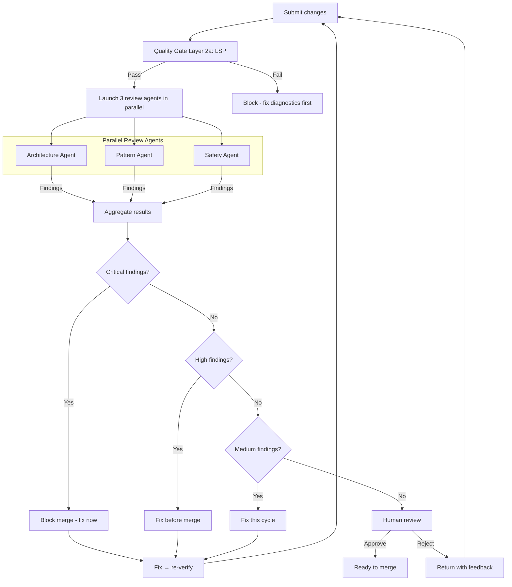

# Code Review Workflow — Super Swing Timer

> **Purpose:** Multi-layered review with parallel specialized agents, deterministic gates, and kill criteria.
> Sources: Augment Code 2026, Anthropic Code Review, KiloCode, Claude Lab multi-agent patterns.

## Review architecture



---

## 1. PARALLEL REVIEW AGENTS

### 1.1 Architecture Agent
**Focus:** File placement, separation of concerns, cross-file coupling, architectural violations

**Checks:**
```
✓ Correct file per AGENTS.md file map? (No feature logic in bootstrap)
✓ Class-specific in ClassMods.lua? Weave math in Weaving.lua?
✓ New setting touches ALL 6: DB_DEFAULTS → migration → apply fn → config → README → TOC?
✓ No circular dependencies introduced?
✓ Are changes coherent within the existing architecture?
```

**Severity assignments:**
- **Critical:** Feature logic in bootstrap file, cross-file circular dependency
- **High:** Wrong file for domain logic, missing migration path  
- **Medium:** Non-standard but workable organization
- **Low:** Style preference

### 1.2 Pattern Agent
**Focus:** Existing convention usage, consistency with established patterns, doesn't reinvent wheels

**Checks:**
```
✓ Classic-era API signatures only? (No Retail-only assumptions)
✓ ns.GetSpellInfo wrapper used? (Not bare GetSpellInfo)
✓ UnitCastingInfo() parsed spell-name-first? (Classic-safe)
✓ UNIT_SPELLCAST_* uses (unit, castGUID, spellID) payload?
✓ GetTimePreciseSec() with GetTime() fallback?
✓ Follows the existing pattern for similar features?
✓ Uses the shared helper/utility functions instead of repeating logic?
```

**Severity assignments:**
- **Critical:** Classic API incompatibility (crashes on Classic client)
- **High:** Using wrong pattern for the feature type (e.g., weaving math in state engine)
- **Medium:** Existing helper exists but wasn't reused
- **Low:** Minor deviation from naming conventions

### 1.3 Safety Agent
**Focus:** Lua correctness, nil safety, undefined globals, cascade errors, WoW API edge cases

**Checks:**
```
✓ No bare local before ns definition (silently kills non-hunter classes)
✓ All end statements match their blocks (no cascade errors)
✓ OnUpdate closures capture correctly (no prevOnUpdate globals)
✓ rawget imports present (strtrim, etc.)
✓ No shadowed/unused locals
✓ Latency applied only to predictive windows, never live anchors
✓ MH/OH/enemy bars combat-only; idle bars reset to empty
✓ Spark uses color-preserving blend mode
✓ Class-color toggling preserves manual saved colors
```

**Severity assignments:**
- **Critical:** Silent class-breaking bug, cascade error, undefined global
- **High:** Shadowed variable, wrong API version, potential nil access
- **Medium:** Unused variable, minor scope issue
- **Low:** Code style / readability

---

## 2. AGGREGATION

### 2.1 Merge strategy
All three agents run simultaneously via `Promise.allSettled` pattern:
- If one agent fails (timeout, API error), the other two results still count
- Only agents that returned valid results block on their severity thresholds
- `Promise.all` would abort the entire review on a single failure — we DO NOT use it

### 2.2 Finding format

Every finding MUST follow this structure:

```
## [SEVERITY] {Short title}
**Agent:** Architecture / Pattern / Safety  
**File:** path/to/file.lua:{line}  
**Current:** What the code does now  
**Problem:** Why this is wrong  
**Fix:** What to change (specific, actionable)  
```

### 2.3 Threshold aggregation

| Outcome | Condition | Action |
|---------|-----------|--------|
| **Block** | Any agent reports Critical finding | All work stops, fix required |
| **Flag** | Any agent reports High finding | Fix before merge |
| **Note** | Any agent reports Medium finding | Fix this cycle |
| **Style** | Any agent reports Low finding | Defer if needed |

### 2.4 Cross-agent conflict resolution
If two agents disagree (e.g., Architecture says "move to new file" and Pattern says "keep existing pattern"):
- Check which severity is higher
- If equal, Architecture defers to Pattern (existing conventions > theoretical purity)
- If both are High, flag as a design decision for human review

---

## 3. HUMAN REVIEW GATE

### 3.1 What humans should focus on

After all automated gates pass, human review checks what agents cannot:

```
✓ Does the solution actually solve the stated problem?
✓ Are there edge cases the agent reviews missed?
✓ Did the agent change anything it wasn't asked to (scope creep)?
✓ Are the architectural decisions sound long-term?
✓ Is the diff comprehensible? (If not, the task was too large)
```

### 3.2 Human review workflow

```
FOR the orchestrator (you, the agent):

1. Present the aggregated review summary to the user
2. For each finding, state: severity → file → what's wrong → proposed fix
3. If Block findings exist, ask: "Proceed with fixes?"
4. If no Block findings, ask: "Approve these changes or request adjustments?"
5. On approval: confirm merge, update AGENTS.md if significant change
6. On rejection: capture specific feedback, reopen with comments

FOR the user (human reviewer):

Focus review energy on:
- Interface boundaries (does the output match the contract?)
- Error handling (did the agent handle edge cases or assume happy path?)
- Test coverage (are the tests testing behavior, not implementation details?)
- Unexpected changes (agents sometimes "improve" things you didn't ask about)
```

---

## 4. KILL CRITERIA

| Condition | Action |
|-----------|--------|
| Same file fails LSP gate 3 consecutive times | Abort session — approach is fundamentally wrong |
| Agent touches files outside declared scope | Abort immediately — review what changed, re-scope |
| Agent tests fail for 2 fix cycles | Abort — add failing test cases to prompt, relaunch |
| Change exceeds 500 lines/single file or 2000/session | Reject — task too large, decompose further |
| Secrets pattern detected in diff | ALWAYS abort — human must verify no leak |
| Diff creates more new files than modified | Flag — possible unnecessary abstraction |

---

## 5. QUALITY GATES (summary)

Review is Layer 4 in the quality gates stack (`workflows/quality-gates.md`):

| Layer | Gate | Auto? | Blocks? |
|-------|------|-------|---------|
| 1a | Formatting | ✅ Auto-fix | — |
| 1b | Secrets | ✅ Scan | ✅ Blocks |
| 1c | Diff-size | ✅ Check | ✅ Blocks |
| 2a | LSP Diagnostics | ✅ Run | ✅ Blocks |
| 2b | Type check | ✅ Run | ✅ Blocks |
| 3 | Tests | ✅ Run | ✅ Blocks |
| **4a** | **AI Review (parallel)** | **✅ Run** | **✅ If Critical** |
| **4b** | **Human Review** | **❌ Manual** | **✅ Required** |

---

## 6. SEVERITY GUIDE

| Sev | Meaning | Action |
|-----|---------|--------|
| **Critical** | Silent class-breaking, cascade errors, undefined globals, API incompatibility | Block, fix now |
| **High** | Wrong file, missing migration, wrong pattern choice | Fix before merge |
| **Medium** | Non-standard pattern, missing docs, minor inconsistency | Fix this cycle |
| **Low** | Style, naming, comments, readability | Defer if needed |

---

## 7. POST-REVIEW CHECKLIST

- [ ] All 3 parallel review agents ran (or accounted for failures)
- [ ] All Critical findings resolved
- [ ] All High findings resolved
- [ ] Human review completed
- [ ] No files outside scope were modified
- [ ] Context files updated per sync protocol
- [ ] AGENTS.md "Current progress" updated if significant
- [ ] `.tmp/context/{session-id}/` cleaned up (if delegation was used)

---

**🔄 Sync hook:** If review agent roles, parallel dispatch, aggregation rules, kill criteria, or severity thresholds change, update this file. Master protocol → `standards/code.md`
