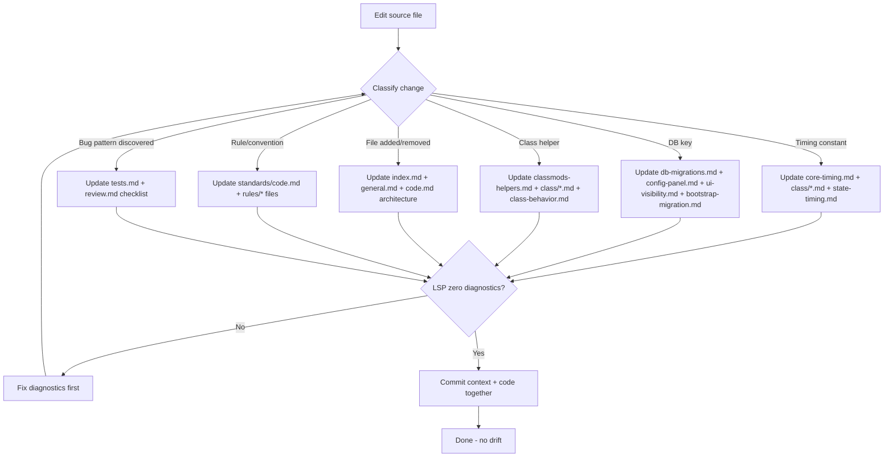
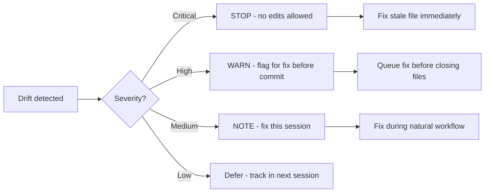

# Context Synchronization Protocol — Super Swing Timer

> **Purpose:** Prevent context drift between `.opencode/` files and source code.
> The agent MUST maintain this automatically — no human should need to request resyncs.

## Core principle

Context files are a **reference contract**, not documentation. When they drift from source code, the agent produces wrong code — worse than no context at all. Sync must be:
- **Triggered automatically** at session boundaries
- **Verified against source code**, not other context files
- **Baked into the agent's workflow**, not an optional manual step

---

## 1. SYNCHRONIZATION PROTOCOL

### 1.1 Mandatory sync points

| Trigger | Action | Auto? |
|---------|--------|-------|
| **Session start** | Load `index.md` → check all paths resolve → verify TOC version matches | Yes |
| **Before write/edit** | Load matching `standards/*.md` + `rules/subsystem/*.md` for target file | Yes |
| **After write/edit** | Run `What changed?` against auto-decay checklist → update affected `.opencode/` files | Yes |
| **Session mid-point** (3+ edits) | Pause → verify context files still match source → resync if drifted | Self-trigger |
| **Session end** | Full sync sweep: every `.opencode/` file verified against source → commit together | Yes |
| **Context compaction** | Re-read `index.md` + `standards/code.md` key-file index → re-establish reference points | Yes |

### 1.2 Sync loop pattern



### 1.3 Stale file detection

When context compaction or a new session starts, verify ALL these conditions:

```
✓ Can read every file referenced in index.md (paths resolve)
✓ TOC version in index.md matches SuperSwingTimer.toc
✓ DB version in db-migrations.md matches ns.db.version in Constants.lua
✓ Setup* line numbers in class-behavior.md match actual ClassMods.lua
✓ Sync hook footers present on ALL .opencode/ files
✓ Every rules/class/<class>.md mentions all current helper bars/toggles
```

If any check fails → **STOP** → fix the stale file before proceeding.

---

## 2. KEY FILE INDEX

A weighted index of critical files that must be read before certain actions.
Higher weight = more important, read first.

### 2.1 Core index (these are ALWAYS read)

```yaml
# Auto-read during: session start, context compaction, before any .lua edit
entries:
  - path: "AGENTS.md"
    weight: 1.0
    kind: pattern
    reason: "File map, working rules, changelog — source of truth"
    applies: [init, resume, proceed]
  - path: ".opencode/context/core/standards/code.md"
    weight: 1.0
    kind: command
    reason: "Master sync protocol, MUST rules, auto-decay checklist"
    applies: [init, resume, proceed]
  - path: ".opencode/context/index.md"
    weight: 0.9
    kind: design
    reason: "Full context file map with correct relative paths"
    applies: [init, resume]
```

### 2.2 File-specific index (read before editing that file)

```yaml
# Applied based on which file you're editing
entries:
  - path: ".opencode/context/core/references/core-timing.md"
    weight: 0.8
    kind: pattern
    reason: "All timing constants — MUST match Constants.lua"
    applies: [edit-state, edit-constants, edit-weaving]
  - path: ".opencode/context/core/references/db-migrations.md"
    weight: 0.8
    kind: design
    reason: "All DB keys, defaults, migration versions — MUST match source"
    applies: [edit-config, edit-bootstrap, edit-constants]
  - path: ".opencode/context/core/references/config-panel.md"
    weight: 0.8
    kind: design
    reason: "Every /sst row → DB key mapping — MUST match Config.lua"
    applies: [edit-config]
  - path: ".opencode/context/core/references/classmods-helpers.md"
    weight: 0.8
    kind: pattern
    reason: "Helper registry, callbacks, line numbers — MUST match ClassMods.lua"
    applies: [edit-classmods]
```

### 2.3 When to read what

| Command/Action | Read files with applies: |
|---------------|------------------------|
| Session init | `init` |
| Context recovery (compaction) | `init, resume` |
| Before editing any `.lua` | `proceed` + filter by file type |
| Before delegation | `proceed` + all subsystem rules |
| Before merge/commit | `proceed` + auto-decay checklist |

---

## 3. DRIFT DETECTION SYSTEM

### 3.1 Types of drift

| Drift type | Detection method | Severity |
|-----------|-----------------|----------|
| **Version drift** | TOC version vs index.md version | Critical — block |
| **DB key drift** | Constants.lua DB_DEFAULTS vs db-migrations.md | Critical — block |
| **Line number drift** | grep Setup\* line numbers vs class-behavior.md | High — fix before commit |
| **Path drift** | All index.md paths resolve to real files | High — fix before commit |
| **Hook drift** | Sync hook footers present on all .opencode/*.md | Medium — fix this session |
| **Content drift** | core-timing.md constants match source defaults | Medium — fix on discover |
| **Documentation drift** | README/CHANGELOG mention current features | Low — fix this cycle |

### 3.2 Automated drift check

Run this before every commit (can be scripted or done manually):

```
1. grep "## Version:" SuperSwingTimer.toc → extract version string
2. grep "v0.0." index.md → verify index version matches TOC
3. grep "ns.db.version" Constants.lua → extract DB version number  
4. grep "v42\|v43" db-migrations.md → verify migration covers current version
5. grep "local function Setup" ClassMods.lua → extract line numbers
6. Compare against class-behavior.md Setup\* line numbers table
7. For each index.md path reference → Test-Path to verify it resolves
```

### 3.3 When drift is detected



---

## 4. PROPOSAL WORKFLOW (for context updates)

When the agent discovers a context file is stale:

### 4.1 Automatic (high confidence)
For **mechanically verifiable drifts** (wrong line numbers, version mismatch, missing key):
1. Detect the drift
2. Fix the context file to match source
3. Note the fix in commit message
4. No approval needed — these are corrections, not decisions

### 4.2 Proposal (medium confidence)
For **content drifts** (timing constant changed meaning, helper behavior changed):
1. Detect the drift  
2. Draft a diff showing current (wrong) → proposed (correct)
3. Present: "Found drift in `core-timing.md`: `ns.CAST_WINDOW` = 0.4 in file but 0.5 in source. Fix?"
4. Apply on approval

### 4.3 Escalation (low confidence)
For **ambiguous drifts** (pattern changed but intent unclear):
1. Flag the discrepancy
2. Show both the context file version and the source version
3. Ask: "Which is correct — update context to match source, or source to match context?"

---

## 5. SYNCHRONIZATION FALLBACKS

### 5.1 If source is the truth (default)
Source code is always authoritative. When source and context disagree:
- **Source is correct** — update context to match source
- **Exception**: migration versions already shipped (v30-v34) are immutable

### 5.2 If context was just updated but source hasn't caught up
Context files document the **current state** of source. If you update context first:
- Mark the context update as "pre-sync" with a `# Pre-sync: <expected change>` comment
- Update source to match within the same session
- Remove the pre-sync marker once source matches

### 5.3 Recovery from drift accumulation
If drift has been accumulating across multiple sessions:
1. Full audit: re-read every source file, cross-check every context file
2. Binary search: find the session where each drift was introduced
3. Fix in order: version → path → line numbers → content → documentation
4. **Commit context and code together** — never one without the other

---

## 6. SYNC HOOK MAINTENANCE

Every `.opencode/` file MUST end with a sync hook footer.

### 6.1 Verify sync hooks
```
# Check every .opencode file has a sync hook
Get-ChildItem -Recurse -Path ".opencode" -Include "*.md" | 
  ForEach-Object { 
    $lastLine = Get-Content $_.FullName -Tail 1
    if ($lastLine -notmatch "Sync hook") {
      Write-Warning "MISSING: $_"
    }
  }
```

### 6.2 Add missing hooks
If a file is missing its sync hook, add one with the appropriate trigger condition from the master protocol table in `standards/code.md`.

---

**🔄 Sync hook:** If sync protocol, drift detection rules, key file index, or proposal workflow changes, update this file. Master protocol → `standards/code.md`
