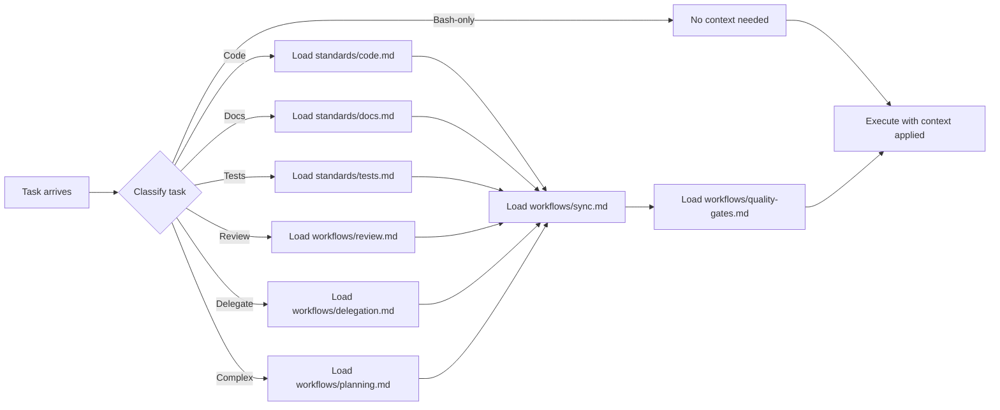
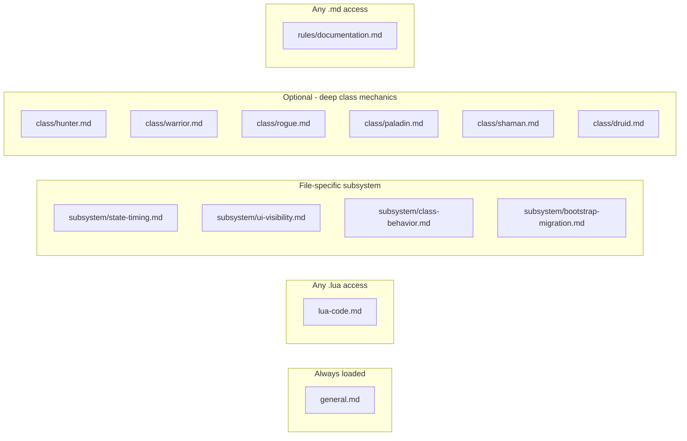

# Super Swing Timer — Context Index

## Project
WoW Classic/TBC swing-timer addon (Lua). Tracks MH/OH/ranged/enemy swing timers with class-specific overlays for Hunter, Warrior, Rogue, Paladin, Shaman, Druid.

## Source of truth
- **`AGENTS.md`** (root) — file map, file responsibilities, working rules, changelog
- **`memory-bank/`** — projectBrief, systemPatterns, techContext, activeContext, copilot-rules, progress
- **`SuperSwingTimer.toc`** — addon metadata, load order (v0.0.8)
- **`.opencode/`** — agent instructions and modular rules

## Context loading flow

## Reference files (manual load for timing accuracy)
| File | Content |
|------|---------|
| `core/references/core-timing.md` | **Single source of truth** for all timing constants — clock domain, latency model, parry haste math, bar heights, spell categories, class config matrix, default colors. Cross-references every class file with exact values from source code. |
| `core/references/config-panel.md` | Every `/sst` control row → DB key mapping. Section headers, quick controls, MH/OH appearance, shaman weave, general behavior, weave families. |
| `core/references/db-migrations.md` | Full migration changelog (v2→v43). Every DB key with type, default value, and added version. |
| `core/references/classmods-helpers.md` | Complete helper registry for all 6 class `Setup*()` functions. Every badge, bar, timer, callback, and trigger condition. |

## Context files (loaded per task type)

| File | Load when... | Key content |
|------|-------------|-------------|
| `core/standards/code.md` | Editing `.lua` files | MUST rules, API compat, timer model, key-file index, master sync protocol |
| `core/standards/docs.md` | Writing README/docs | README sections, changelog format, tone |
| `core/standards/tests.md` | Running/adding tests | LSP validation, pre-submit checklist, known failure modes |
| `core/workflows/planning.md` | Complex multi-step tasks | Task decomposition, dependency management, atomicity criteria |
| `core/workflows/sync.md` | Session start, compaction, any context operation | Drift detection, key-file index, proposal workflow, stale recovery |
| `core/workflows/quality-gates.md` | Before every commit/merge | 8-layer gate system, kill criteria, enforcement rules |
| `core/workflows/review.md` | Reviewing code before merge | Parallel review agents, aggregation, severity thresholds |
| `core/workflows/delegation.md` | Delegating to subagents | Context bundle template, handoff contracts, coordination patterns |

## Rule files

| File | Trigger | Content |
|------|---------|---------|
| `../rules/general.md` | Always | Project overview, commands, architecture diagram |
| `../rules/lua-code.md` | Any `**/*.lua` | Cross-cutting MUST rules + session discipline |
| `../rules/subsystem/state-timing.md` | `*State.lua`, `*Weaving.lua`, `*Constants.lua` | Timer model, combat-log, constants, weaving. Cross-refs `core/references/core-timing.md`. |
| `../rules/subsystem/ui-visibility.md` | `*UI.lua`, `*Config.lua` | Bar creation, textures, spark, OnUpdate, visibility. Cross-refs `core/references/config-panel.md` + `core/references/db-migrations.md`. |
| `../rules/subsystem/class-behavior.md` | `*ClassMods.lua` | Per-class hooks, overlay patterns, class ref pointers. Cross-refs `core/references/classmods-helpers.md`. |
| `../rules/subsystem/bootstrap-migration.md` | `SuperSwingTimer.lua` | SV migration, slash commands, event reg. Cross-refs `core/references/db-migrations.md` + `core/references/config-panel.md`. |
| `../rules/class/hunter.md` | Manual load for deep work | Auto Shot, Steady Shot grace, cast bar mechanics, Range Helper, Rapid Fire |
| `../rules/class/warrior.md` | Manual load for deep work | HS/Cleave queue, Shield Block, Slam, parry haste |
| `../rules/class/rogue.md` | Manual load for deep work | SS cue, SnD, energy helper, combo points, Adrenaline Rush |
| `../rules/class/paladin.md` | Manual load for deep work | Seal twist zone, seal families, visual layering |
| `../rules/class/shaman.md` | Manual load for deep work | Weave breakpoints, markers, shamanistic rage |
| `../rules/class/druid.md` | Manual load for deep work | Form tracking, maul, ravage opener, Power Shift, Energy Tick |
| `core/references/core-timing.md` | Manual load for timing verification | All timing constants, clock model, latency, parry haste math, bar heights, spell categories, class matrix, default colors |
| `core/references/config-panel.md` | Manual load for config work | Every `/sst` row mapped to DB key, section structure, control types |
| `core/references/db-migrations.md` | Manual load for migration work | Full changelog v2→v43, all 60+ DB keys with types and defaults |
| `core/references/classmods-helpers.md` | Manual load for class work | Helper registry, callback map, timing constants per class |
| `../rules/documentation.md` | Any `**/*.md` | Doc conventions, Mermaid allowed in .opencode |
| `core/standards/code.md` | Always (extends index) | **Master sync protocol** — run before every commit |

---
**🔄 Sync hook:** If context file structure, loading flow, file paths, or rule file triggers change, update this index. Master protocol → `standards/code.md`
