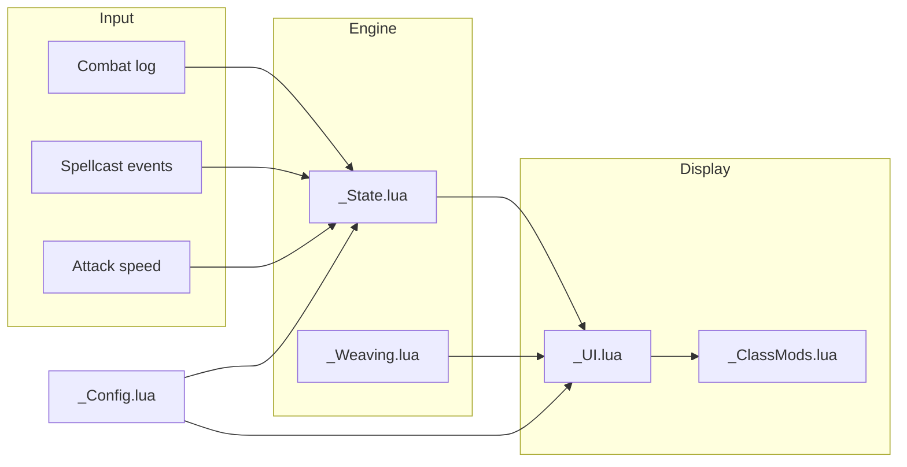

# Super Swing Timer — General Rules (always loaded)

## Project
WoW Classic/TBC swing-timer addon (Lua). v0.0.8, feature-complete.

## Commands
- `git log --oneline -10` — recent history

## Architecture — data flow

## Architecture — file roles
| File | Role |
|------|------|
| `SuperSwingTimer.lua` | Bootstrap + migration + events only |
| `SuperSwingTimer_Constants.lua` | Spell IDs, defaults, static data |
| `SuperSwingTimer_State.lua` | Timer math, combat-log, swing logic |
| `SuperSwingTimer_UI.lua` | Bars, textures, OnUpdate, visibility |
| `SuperSwingTimer_ClassMods.lua` | Per-class overlays (Hunter, Warrior, Rogue, Paladin, Shaman, Druid) |
| `SuperSwingTimer_Weaving.lua` | Shaman breakpoint math only |
| `SuperSwingTimer_Config.lua` | `/sst` panel, live preview |

## Source of truth
- `AGENTS.md` — file map, working rules, changelog
- `memory-bank/` — projectBrief, systemPatterns, techContext, activeContext, copilot-rules
- `.opencode/context/` — per-task standards + workflows (sync/planning/quality-gates/review/delegation)

---
**🔄 Sync hook:** If file architecture or roles change, update sections above. Master protocol → `standards/code.md`

