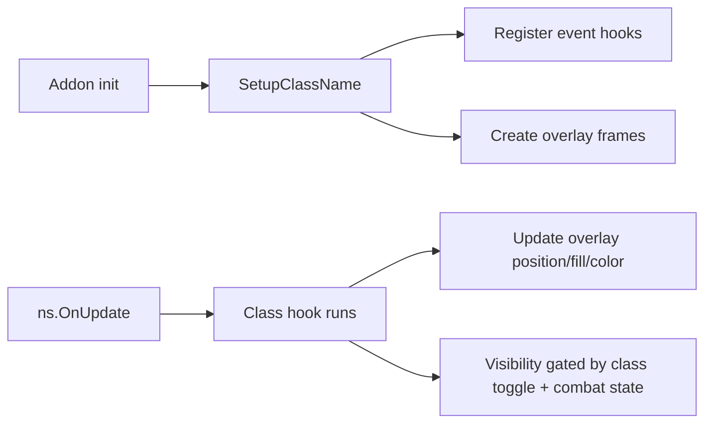

---
globs:
  - '**/*ClassMods.lua'
---

# Class Behavior — Rules for class-specific code

## MUST
- **All** class-specific behavior goes in `ClassMods.lua` — never in state, UI, or config files
- Each class gets a `Setup<ClassName>()` function called at addon init
- Each class has a `ClassMods_<ClassName>` prefix convention for overlay frame names
- Never modify core state engine (`ns.mhState`, `ns.ohState`, `ns.rangedState`) from class mods
- Use `ns.hooks.<event>` table for event subscriptions, not bare frame event handlers

## Class overlay pattern

## Available class hooks
| Hook | When it fires | Used by |
|------|--------------|---------|
| `PreBarUpdate` | Before bar fill recalculated | Hunter, Rogue |
| `PostBarUpdate` | After bar fill rendered | Warrior, Paladin |
| `OnCastStart` | `UNIT_SPELLCAST_START` | Hunter, Shaman |
| `OnCastSucceeded` | `UNIT_SPELLCAST_SUCCEEDED` | All classes |
| `OnVisibility` | Visibility recalculated | All classes |
| `OnTargetChange` | `PLAYER_TARGET_CHANGED` | Rogue, Druid |

## Setup functions (ClassMods.lua)

| Setup function | Line | Class | Helpers created |
|---------------|------|-------|-----------------|
| `SetupRetPaladin()` | 166 | Paladin | Seal twist zone, reseal line, judgement marker, reckoning badge, libram swap badge |
| `SetupWarrior()` | 625 | Warrior | Rage bar, Shield Block bar, Flurry counter, Execute badge, Enrage badge |
| `SetupEnhShaman()` | 1223 | Shaman | Weave spark, triangle top/bottom, Windfury ICD bar, Flurry badge |
| `SetupDruid()` | 1613 | Druid | Form color/label, Maul tint, Ravage cue, Power Shift bar, Energy Tick bar, Tiger's Fury badge, Faerie Fire badge, Omen glow, Rage dim |
| `SetupHunter()` | 2239 | Hunter | Range helper bar, Rapid Fire bar, Raptor tint, cast bar latency slice |
| `SetupRogue()` | 2671 | Rogue | SS cue zone, energy tick bar, energy total bar, combo point strip, SnD bar, AR bar, BF/CB badges |

## Callbacks cleared and re-registered per class
See dispatch at `ns.InitClassMods()` line 3494:
- Clears: `ns.OnBarsCreated`, `ns.OnDruidFormChange`, `ns.OnMeleeSwing`, `ns.OnRangedSwing`
- Clears: `ns.Update*QueueTint`, `ns.Clear*QueueTint`, `ns.Update*Color`, `ns.Update*Visual`
- Clears: `ns.Handle*` event listeners
- Clears state: `ns.*QueuedMeleeSpell`, `ns.rogue*`, `ns.hunterRangeHelperBar`, etc.
- Resets visibility on all class-specific frames

## Agent coordination patterns
- **Single-owner rule**: Each helper bar/timer/callback is owned by exactly one Setup* function. No two classes share a helper.
- **Interface contracts**: When adding a new callback (`ns.OnDruidFormChange`, etc.), define the signature and what it returns BEFORE implementing the class hook
- **File isolation**: ClassMods.lua reads from state (read-only) and writes to overlays (local frames). Never write to state from ClassMods.
- **Cross-class compatibility**: Always guard class-specific code behind `if ns.playerClass == "CLASSNAME"` — a bug in one class must never affect another
- **Pre/post update chain**: Class hooks run via `PreBarUpdate`/`PostBarUpdate` — never modify bar state mid-update. Queue changes for the next frame.

## Full helper registry
- Every badge, bar, timer, and trigger condition: `references/classmods-helpers.md`
- Timing constants and formulas: `references/core-timing.md`
- Line numbers (`Setup*` functions) verified against source during context sync: `workflows/sync.md`

## Helper classes reference
For deep class-specific mechanics, load the relevant file from `rules/class/`:

| Class | File | Key mechanics |
|-------|------|--------------|
| Hunter | `rules/class/hunter.md` | Auto Shot, Steady Shot grace, cast bar, Multi-Shot, Raptor Strike |
| Warrior | `rules/class/warrior.md` | Heroic Strike/Cleave queue, Shield Block, Slam, parry haste |
| Rogue | `rules/class/rogue.md` | Sinister Strike cue, Slice and Dice, energy helper, combo points |
| Paladin | `rules/class/paladin.md` | Seal twisting, judgement timing, reseal line, twist zone |
| Shaman | `rules/class/shaman.md` | Weave breakpoints, spell catalog, totems, shamanistic rage |
| Druid | `rules/class/druid.md` | Form tracking, maul, ravage opener |

---
**🔄 Sync hook:** If class overlay patterns, dispatch, callbacks, coordination rules, or line numbers change, update this file + `references/classmods-helpers.md` + matching `rules/class/*.md`. Master protocol → `standards/code.md`
