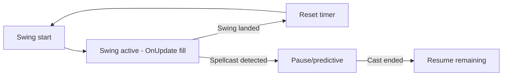

---
globs:
  - '**/*State.lua'
  - '**/*Weaving.lua'
  - '**/*Constants.lua'
---

# State & Timing — Rules for timer engine files

## Timer model
- Swing logic on `OnUpdate` per-frame; `C_Timer` only for one-shot/low-freq UI delays
- **MUST** use `ns.GetAlignedTime()` (canonical precision clock via `GetTimePreciseSec()` → `GetTime()`) — DO NOT call `ns.GetCurrentTime()`, that ns-level function does not exist; a local `GetCurrentTime` alias exists in Constants.lua
- **MUST** apply `GetNetStats()` latency to predictive windows **only** — never to live swing anchors
- Separate timers for `mh`, `oh`, `ranged` (three independent state machines)
- No mixed clock-domain drift: swing bars use latency-adjusted clock, cast timestamps use raw API times

## Combat-log & spellcast
- `UNIT_SPELLCAST_*` handlers: `(unit, castGUID, spellID)` payload
- `UnitCastingInfo()` parsed spell-name-first (Classic-era safe)
- Player-only filtering for `UNIT_ATTACK_SPEED` / `UNIT_RANGEDDAMAGE`
- `select()` or `_` for unused CLEU return values

## Swing lifecycle

## Constants pattern
- `ns.DB_DEFAULTS` — all defaults in one place
- `UPPER_SNAKE_CASE` for constants (`ns.STEADY_SHOT_CAST_TIME`, `ns.CAST_WINDOW`)
- Spell IDs in lookup tables, not scattered inline
- Magic numbers in Constants, not in logic files

## Weaving (shaman-specific)
- Breakpoint math in `_Weaving.lua` only — owns no swing state
- Spell catalog with cast times
- Cast-time-plus-latency markers for breakpoints

## Timing reference
- **All timing constants** (exact values from source): `references/core-timing.md`
- Clock domain: `ns.preciseClockOffset = GetTime() - GetTimePreciseSec()` at load
- Latency: `ns.cachedLatency` from `GetNetStats()`, refreshed every `LATENCY_REFRESH_INTERVAL=0.05` during casts
- Key constants: `ns.CAST_WINDOW=0.5`, `ns.STEADY_SHOT_CAST_TIME=1.5`, `PALADIN_TWIST_WINDOW=0.4`, `GCD_DURATION=1.5`, `SWING_FLASH_DURATION=0.08`
- Swing start fallback: `2.0` seconds (State.lua:621) when no speed data available
- Full swing lifecycle: `idle → swinging → (landed|reset|pause|resume)`
- Spell reset/pause categories: attack-stop, cast-time, channelled, queued-NMA — each in `ns.SWING_RESET_IDS` / `ns.SWING_PAUSE_IDS` tables
- Parry haste: 40% reduction of remaining swing, 20% duration floor (State.lua:936–956)
- Extra attack suppression: `ns.extraAttackPending` counter from `SPELL_EXTRA_ATTACKS` events
- Bar height formulas (11 total): see `references/core-timing.md` "Bar height/width math" section — includes OH, SnD, CP, energy tick, SnD bar, AR bar, Shield Block, Hunter cast bar, Hunter range helper, Hunter Rapid Fire, Druid Power Shift, Druid energy tick (all derived from mhHeight or with dedicated DB sliders)

## Drift-aware agent patterns
- **Constants MUST be single-sourced**: Every timing value lives in Constants.lua and is referenced via `ns.*` — never duplicated in context files
- **Context file sync**: After editing state-timing.md, always verify against `references/core-timing.md` and the source Constants.lua
- **Line number drift**: When state/weaving files grow, re-check `references/classmods-helpers.md` line references
- **Checkpoint pattern**: Before complex state changes (resets, pauses, rescales), cache the previous timer state(`lastSwing`, `duration`) to enable rollback
- Class config matrix: 9 classes × 4 features (ranged/melee/dualWield/hunterCastBar) — see `references/core-timing.md`

---
**🔄 Sync hook:** If timer math, constants, or combat-log patterns change, update this file. Master protocol → `standards/code.md`
