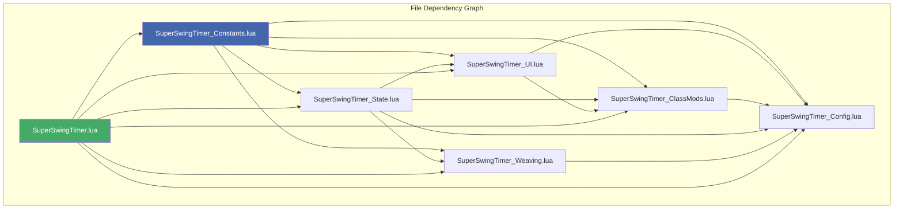
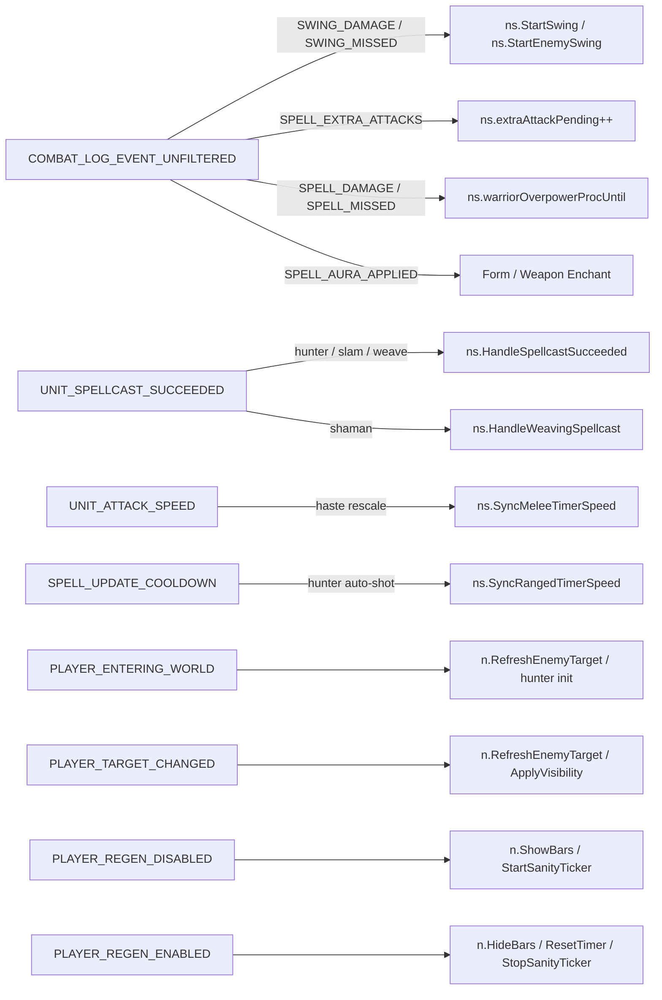

```mermaid
flowchart TD
    OU["ns.OnUpdate(elapsed)"] --> R1["1. UpdateRangedBar(elapsed)"]
    OU --> R2["2. UpdateHunterCastBar()"]
    OU --> R3["3. UpdateMeleeBar('enemy')"]
    OU --> R4["4. UpdateMeleeBar('mh')"]
    OU --> R5["5. UpdateMeleeBar('oh')"]
    OU --> R6["6. UpdateGcdTicker(elapsed)"]
    OU --> R7["7. UpdateSwingFlash + RenderSwingFlash"]
    OU --> R8["8. Class nil-guarded updates"]
    R8 --> W1["UpdateWarriorQueueTint"]
    R8 --> W2["UpdateDruidQueueTint"]
    R8 --> W3["UpdateHunterQueueTint"]
    R8 --> W4["UpdateHunterRangeHelperVisual"]
    OU --> R9["9. UpdateHunterRapidFire(elapsed)"]
    OU --> R10["10. UpdateWarriorFlurryCounter"]
    OU --> R11["11. UpdateRogueAdrenalineRush"]
    OU --> R12["12. UpdateShamanWindfuryIcd"]

    style OU fill:#4a6,color:#fff
    style R8 fill:#84a,color:#fff
```

# Super Swing Timer — Wiring Diagram

> Reference document extracted from AGENTS.md. Contains full cross-file wiring of all 7 source files: initialization order, event dispatch, ns.* namespace surface, shared state, call chain examples, OnUpdate pipeline, and dependency graph.

---



<details>
<summary><strong>Event → Handler flow</strong></summary>



</details>

<details>
<summary><strong>OnUpdate render pipeline (every frame)</strong></summary>



</details>

---

## 1. Initialization order

```
ADDON_LOADED → OnAddonLoaded()
  ├── Migration pipeline (MigrateDB up to v49)
  ├── ns.playerClass = select(2, UnitClass("player"))
  ├── ns.classConfig = CLASS_CONFIG[ns.playerClass]
  ├── Apply settings to ns namespace from DB
  ├── ns.InitClassMods()          → SuperSwingTimer_ClassMods.lua
  │     └── SetupHunter() / SetupWarrior() / SetupShaman() / SetupRogue() / SetupPaladin() / SetupDruid()
  │         → Each registers ns.* class-specific functions into global ns table
  ├── ns.InitWeaving()            → SuperSwingTimer_Weaving.lua (SHAMAN only)
  ├── ns.InitBars()               → SuperSwingTimer_UI.lua
  │     └── CreateEnemyBar(), CreateRangedBar(), CreateMHBar(), CreateOHBar(), CreateHunterCastBar(), AttachDrag(), RestorePosition()
  ├── ns.InitConfig()             → SuperSwingTimer_Config.lua
  ├── PLAYER_ENTERING_WORLD → OnPlayerEnteringWorld()
  │     └── ns.RefreshEnemyTarget(), hunter auto-repeat sync, class energy init
  └── RegisterEvents()            → main event loop
```

## 2. Event wiring

Every event is registered in `SuperSwingTimer.lua` and dispatched to handler functions across other files.

| Event | Handler in SuperSwingTimer.lua | Dispatches to (file) | Notes |
|---|---|---|---|
| `ADDON_LOADED` | OnAddonLoaded | InitClassMods (ClassMods), InitWeaving (Weaving), InitBars (UI), InitConfig (Config) | One-shot |
| `COMBAT_LOG_EVENT_UNFILTERED` | ns.HandleCLEU() | **State.lua**: SWING_DAMAGE/SWING_MISSED → StartSwing/StartEnemySwing; SPELL_CAST_SUCCESS → tracking; SPELL_EXTRA_ATTACKS → extraAttackPending; SPELL_DAMAGE/MISSED → Overpower proc; SPELL_AURA_APPLIED → druid form/weapon enchants; UNIT_DIED/DESTROYED → enemyGUID clear | ⬅️ **Primary timer driver** |
| `UNIT_SPELLCAST_SUCCEEDED` | ns.HandleSpellcastSucceeded | **State.lua**: hunter cast tracking, slam timing, weave preview, queue state | Also → HandleWeavingSpellcast (SHAMAN) |
| `UNIT_SPELLCAST_START` | ns.HandleSpellcastStart | **State.lua**: cast start time, GCD state, hunter cast bar anchor | Also → HandleWeavingSpellcast (SHAMAN) |
| `UNIT_SPELLCAST_CHANNEL_START` | ns.HandleSpellcastChannelStart | **State.lua**: channel start | Also → HandleWeavingSpellcast (SHAMAN) |
| `UNIT_SPELLCAST_STOP` | ns.HandleSpellcastStop | **State.lua**: clear cast, trigger SyncRangedTimerSpeed | Also → HandleWeavingSpellcast (SHAMAN) |
| `UNIT_SPELLCAST_CHANNEL_STOP` | ns.HandleSpellcastChannelStop | **State.lua**: clear channel | Also → HandleWeavingSpellcast (SHAMAN) |
| `UNIT_SPELLCAST_INTERRUPTED`/`_FAILED` | ns.HandleSpellcastInterruptedOrFailed | **State.lua**: clear cast/channel, reset weave preview | Also → HandleWeavingSpellcast (SHAMAN) |
| `UNIT_SPELLCAST_DELAYED` | ns.HandleSpellcastDelayed | **State.lua**: update cast end time | Also → HandleWeavingSpellcast (SHAMAN) |
| `PLAYER_STARTED_MOVING` | ns.isMoving = true | **UI.lua**: ns.UpdateCastZoneVisual() | |
| `PLAYER_STOPPED_MOVING` | ns.isMoving = false | **State.lua**: ns.RefreshLatencyCache(); **UI.lua**: ns.UpdateCastZoneVisual() | |
| `PLAYER_TARGET_CHANGED` | ns.RefreshEnemyTarget() | **State.lua**: enemy GUID+speed; **ClassMods.lua**: UpdateShamanFlameShockBar; **UI.lua**: ApplyVisibility | |
| `UNIT_ATTACK_SPEED` | ns.SyncMeleeTimerSpeed("mh/oh") | **State.lua**: haste rescaling | Also enemy |
| `UNIT_AURA` | ns.SanityCheckTimers() | **State.lua** + class dispatchers | |
| `UNIT_POWER_UPDATE`/`_FREQUENT` | ns.HandleRogueEnergyPowerUpdate / HandleDruidEnergyPowerUpdate | **ClassMods.lua** | ROGUE/DRUID |
| `UNIT_RANGEDDAMAGE` | ns.SyncRangedTimerSpeed(nil, true) | **State.lua** | |
| `SPELL_UPDATE_COOLDOWN` | Hunter auto-shot cooldown sync | **State.lua**: GetAutoShotCooldown, IsHunterAutoRepeatActive, SyncRangedTimerSpeed | HUNTER only |
| `UNIT_INVENTORY_CHANGED` | ns.UpdateOHBar(), ns.SanityCheckTimers() | **UI.lua**, **State.lua** | |
| `PLAYER_EQUIPMENT_CHANGED` | ns.UpdateOHBar(), ns.SanityCheckTimers(true) | **UI.lua**, **State.lua**; + HandlePaladinLibramEquipmentChanged | |
| `PLAYER_ENTERING_WORLD` | ns.OnPlayerEnteringWorld() | **State.lua**: initial sync, enemy target, class energy init, weave preview clear | |
| `SPELLS_CHANGED` | RebuildWeaveSpellCatalog() | **Weaving.lua** | SHAMAN |
| `START_AUTOREPEAT_SPELL` | ns.StartRangedSwing() | **State.lua** | HUNTER |
| `STOP_AUTOREPEAT_SPELL` | hunterAutoRepeatActive = false | **State.lua**: update cast zone visual | HUNTER |
| `PLAYER_REGEN_DISABLED` | ns.ShowBars() | **UI.lua**: ShowBars; **State.lua**: StartSanityTicker; **ClassMods.lua**: warrior rage/shield block | Combat start |
| `PLAYER_REGEN_ENABLED` | ns.HideBars() | **UI.lua**: HideBars; **State.lua**: StopSanityTicker, ResetTimer(all), class state clear | Combat end — full reset |
| `UPDATE_SHAPESHIFT_FORM` | ns.OnDruidFormChange() | **ClassMods.lua** | DRUID |

## 3. ns.* namespace surface

### Defined in `SuperSwingTimer_Constants.lua`

**DB defaults:** `ns.DB_DEFAULTS` (v49), `GetBarBackgroundAlpha/Color/Border*`, `GetBarColor/Texture/TextureLayer`, `GetRangedBarTexture`, `GetSpark*`, `GetHunterRangeHelperWidth`, `GetWeave*`, `GetOffHandBarHeight`, `GetRogueComboPointBarHeight`, `GetRogueSliceAndDiceBarHeight`, `GetIndicatorBlendMode`, `GetPlayerClassColor`, `IsMinimalMode`, `AreBarsLocked`

**Wrappers:** `GetAlignedTime()`, `GetSpellInfo(id)`, `GetUnitCastingSpellInfo(unit)`, `IsAutoShotSpell(v)`, `IsHunterCastSpell(v)`, `IsHunterActualCastSpell(v)`, `IsMultiShotSpell(v)`

**Paladin:** `GetPaladinSealFamilyByAuraName`, `GetPaladinSealFamilyBySpellId`

**Texture:** `BuildTextureLibrary()`, `ResolveTextureLayerAboveBar()`, `SetTextureLayerAboveBar()`, `GetTextureBrowserDisplayCategory()`, `GetTextureDisplayText()`, `GetTextureSummaryText()`

### Defined in `SuperSwingTimer_State.lua`

**Timer lifecycle:** `ns.timers.mh/oh/ranged/enemy { state, startTime, endTime, duration, speed, holdEnd }`, `StartSwing(slot)`, `StartEnemySwing()`, `StartRangedSwing()`, `ResetTimer(slot)`, `RescaleTimer(slot, newSpeed)`, `HasActiveTimers()`

**Speed sync:** `SyncMeleeTimerSpeed(slot, now, force)`, `SyncRangedTimerSpeed(now, force)`, `SyncAllTimerSpeeds(force)`

**Hunter:** `GetAutoShotCooldown()`, `IsHunterAutoRepeatActive(fallback)`, `IsHunterRangedPinnedByMovement(now)`, `IsHunterMeleeActive()`, `IsHunterMeleeBarVisible()`, `GetTimeUntilNextHunterRangedShot(now)`

**Handlers:** `HandleCLEU()`, `HandleSpellcastSucceeded(...)`, `HandleSpellcastStart(...)`, `HandleSpellcastChannelStart(...)`, `HandleSpellcastStop(...)`, `HandleSpellcastChannelStop(...)`, `HandleSpellcastDelayed(...)`, `HandleSpellcastInterruptedOrFailed(...)`

**State:** `RefreshLatencyCache()`, `ApplyParryHaste(slot, eventTime)`, `GetGcdDuration()`, `RefreshEnemyTarget()`, `RefreshUpdateLoop()`, `StartSanityTicker()`, `StopSanityTicker()`, `OnPlayerEnteringWorld()`, `SanityCheckTimers(force)`, `RegisterSpellcastSucceededHook(callback)`

### Defined in `SuperSwingTimer_Weaving.lua`

`InitWeaving()`, `HandleWeavingSpellcast(event, ...)`, `RebuildWeaveSpellCatalog()`, `ClearWeavePreview()`, `UpdateShamanFlameShockBar(force)`, `UpdateLightningShieldVisual()`, `UpdateShamanWindfuryIcd()`

### Defined in `SuperSwingTimer_UI.lua`

**Init:** `InitBars()`, `UpdateOHBar()`, `TestBars()`

**Render:** `OnUpdate(elapsed)` — master per-frame render:
1. UpdateRangedBar(elapsed) → fill + green/red zone + spark
2. UpdateHunterCastBar() → cast bar beneath ranged
3. UpdateMeleeBar("enemy") → enemy bar
4. UpdateMeleeBar("mh") → MH bar (queue tints, cue slice, seal zone)
5. UpdateMeleeBar("oh") → OH bar
6. UpdateGcdTicker(elapsed) → GCD indicator
7. UpdateSwingFlash(elapsed) + RenderSwingFlash()
8. ns.UpdateWarriorQueueTint / UpdateDruidQueueTint / UpdateHunterQueueTint
9. ns.UpdateHunterRangeHelperVisual / UpdateHunterRapidFire
10. ns.UpdateWarriorFlurryCounter / UpdateRogueAdrenalineRush / UpdateShamanWindfuryIcd

**Styling:** `ApplyBarSize/Colors/Background*/Border*/Texture*`, `ApplySpark*`, `ApplyWeave*`, `ApplyIndicatorBlendMode`, `ApplyMinimalMode`, `ApplyVisibility`, `ApplyLockBars`, `ApplyRogueCueLayer`

**Labels/drag:** `SetBarLabelText`, `RefreshBarLabelStyles`, `ApplyHunterRangedBarLabel`, `RestoreAllBarPositions`, `GetOverlayFrame`

### Defined in `SuperSwingTimer_ClassMods.lua`

`InitClassMods()` → dispatches to Setup* for current class.

**SetupHunter()** registers: `UpdateCastZoneVisual`, `UpdateHunterQueueTint`, `UpdateHunterRangeHelperVisual`, `UpdateHunterRapidFire`, `ClearHunterCastState`, `IsHunterRangedPinnedByMovement`

**SetupWarrior()** registers: `UpdateWarriorRageBar`, `UpdateWarriorShieldBlockBar`, `UpdateWarriorFlurryCounter`, `UpdateWarriorQueueTint`, `ClearPendingMeleeQueueState`

**SetupRogue()** registers: `HandleRogueSliceAndDiceAura`, `HandleRogueEnergyPowerUpdate`, `UpdateRogueAdrenalineRush`

**SetupDruid()** registers: `OnDruidFormChange`, `HandleDruidEnergyPowerUpdate`, `UpdateDruidQueueTint`

**SetupPaladin()** registers: `HandlePaladinLibramEquipmentChanged`

**SetupShaman()**: weaving functions in Weaving.lua.

### Defined in `SuperSwingTimer_Config.lua`

`InitConfig()`, `ToggleConfig()`, `ResetConfigDefaults()`, `RefreshTextureRows()`

## 4. Shared ns.* state (cross-file data flow)

| Variable | Set by | Read by | Purpose |
|---|---|---|---|
| `ns.timers.mh/oh/ranged/enemy` | State.lua | UI.lua, ClassMods | Primary timer state |
| `ns.playerClass` | SuperSwingTimer.lua | All files | Current player class |
| `ns.classConfig` | SuperSwingTimer.lua | All files | Class-specific config |
| `ns.playerInCombat` | SuperSwingTimer.lua (PLAYER_REGEN_*) | UI.lua, State.lua | Combat state |
| `ns.isMoving` | SuperSwingTimer.lua | State.lua, UI.lua | Movement state |
| `ns.enemyTargetGUID` | State.lua | State.lua, Weaving.lua | Target GUID |
| `ns.casting`/`ns.channeling` | State.lua | UI.lua, ClassMods | Cast/channel in progress |
| `ns.currentCastSpellId`/`ns.currentCastStartTime` | State.lua | UI.lua, Weaving.lua | Active cast details |
| `ns.gcdActive`/`ns.lastGcdTime`/`ns.gcdDuration` | State.lua | UI.lua, ClassMods | GCD state |
| `ns.hunterAutoRepeatActive` | SuperSwingTimer.lua | State.lua, UI.lua, ClassMods | Hunter auto-shot |
| `ns.extraAttackPending` | State.lua | State.lua (StartSwing) | Extra attack suppression |
| `ns.warriorOverpowerProcUntil` | State.lua | ClassMods | Overpower window |
| `ns.preventSwingReset`/`ns.pauseSwingTime` | State.lua | State.lua (StartSwing) | Slam pause |
| `ns.SuperSwingTimerDB` | SuperSwingTimer.lua | All files via Get* | Persisted settings |

## 5. OnUpdate rendering pipeline (SuperSwingTimer_UI.lua:2529)

```
ns.OnUpdate(elapsed)
  ├── 1. UpdateRangedBar(elapsed)       → fill + green/red zone + spark
  ├── 2. UpdateHunterCastBar()          → cast bar beneath ranged
  ├── 3. UpdateMeleeBar("enemy", bar)   → enemy bar fill
  ├── 4. UpdateMeleeBar("mh", bar)      → MH fill + spark + queue tints + cues
  ├── 5. UpdateMeleeBar("oh", bar)      → OH fill + spark
  ├── 6. UpdateGcdTicker(elapsed)       → GCD indicator
  ├── 7. UpdateSwingFlash(elapsed) + RenderSwingFlash()
  ├── 8. Class updates (nil-guarded):
  │     → UpdateWarriorQueueTint / UpdateDruidQueueTint / UpdateHunterQueueTint
  │     → UpdateHunterRangeHelperVisual
  ├── 9. UpdateHunterRapidFire(elapsed)
  ├── 10. UpdateWarriorFlurryCounter(elapsed)
  ├── 11. UpdateRogueAdrenalineRush(elapsed)
  └── 12. UpdateShamanWindfuryIcd()
```

## 6. Dependency graph

```
SuperSwingTimer.lua (orchestrator — depends on everything)
  ├──→ SuperSwingTimer_Constants.lua    (standalone — no deps)
  ├──→ SuperSwingTimer_State.lua        (depends on Constants)
  ├──→ SuperSwingTimer_Weaving.lua      (depends on Constants, State)
  ├──→ SuperSwingTimer_UI.lua           (depends on Constants, State)
  ├──→ SuperSwingTimer_ClassMods.lua    (depends on Constants, State, UI)
  └──→ SuperSwingTimer_Config.lua       (depends on Constants, UI)
```

**Key architectural rules:**
- Constants.lua has zero dependencies — every other file depends on it.
- State.lua and UI.lua have no mutual dependency — both only read ns.* the other writes.
- ClassMods.lua writes ns.* functions called only after InitClassMods returns (nil-guarded with `if ns.Xxx then ns.Xxx() end`).
- Config.lua only reads ns.* values; it never writes timers or timer state directly.
