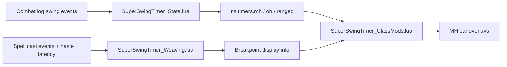

# Design — Weave UI and Swing Timer

This document defines the ship-ready implementation shape for the weave UI feature in Super Swing Timer. It covers the runtime timing model, overlay rendering, configuration controls, release-facing files, and diagnostics expectations.

## 1. Overview

- **Runtime:** Classic / TBC-compatible Lua using the WoW frame API and standard event handlers.
- **Visual surface:** The MH/OH/Ranged bars remain the visual canvas. Weave spark and breakpoint triangles are overlays on the MH bar only.
- **Timing data:** Swing state lives in `ns.timers` for `mh`, `oh`, and `ranged`. Weave calculations read timing state but must never mutate it.
- **Configuration:** `/sst` opens the config panel. Texture selection uses a dropdown built from `ns.BuildTextureLibrary()` with SharedMedia plus Blizzard fallback media.

## 2. Runtime architecture

### 2.1 State layer — `SuperSwingTimer_State.lua`

Responsibilities:

- Own `ns.timers`
- Expose `StartSwing`, `ResetTimer`, `RescaleTimer`, and `ApplyParryHaste`
- Handle CLEU and spellcast events to detect swings, NMAs, and parry events
- Resync weapon speeds using `UnitAttackSpeed`, `UnitRangedDamage`, and a low-frequency sanity ticker

Constraints:

- Must keep MH, OH, and ranged timers independent
- Must not read or write overlay state as part of timing ownership
- Must remain the source of truth for melee swing progression

### 2.2 Weave math layer — `SuperSwingTimer_Weaving.lua`

Responsibilities:

- Maintain local weave state for tracked spells, active cast state, latency, and spell haste
- Rebuild the spell catalog from `ns.WEAVE_SPELL_GROUPS`
- Resolve the first available rank for the tracked weave spells
- Expose `ns.GetWeaveDisplayInfo()` with cast time, cast remaining, latency, next swing expiration, safe-start timing, clip amount, safe flag, text, and color

Constraints:

- Breakpoint math is cast-driven, not swing-driven
- Weave math may read MH timing to help position and display the threshold, but it must not change `ns.timers`
- Haste and network latency must be applied in real time

### 2.3 Visual layer — `SuperSwingTimer_UI.lua` and `SuperSwingTimer_ClassMods.lua`

Responsibilities:

- Create the base bars and overlay textures
- Anchor spark and triangles to the MH bar
- Keep the weave spark cast-only, driven by cast progress (`castElapsed / castTime`)
- Keep triangle markers visible as the persistent breakpoint guide whenever weave assist is enabled and the MH bar exists
- Apply textures, draw layers, alpha, size, and gap settings through runtime apply functions

Constraints:

- Spark and triangle behavior must stay separate
- Visual overlays must not alter swing state
- The MH bar remains the canvas, not the source of timing truth

### 2.4 Config and media layer — `SuperSwingTimer_Config.lua` and `SuperSwingTimer_Constants.lua`

Responsibilities:

- Provide the `/sst` config panel
- Replace the browser picker with a dropdown of `[category] label` rows
- Include SharedMedia entries plus Blizzard fallbacks
- Expose supported draw-layer options
- Update live previews immediately when settings change
- Persist choices to `SuperSwingTimerDB`

## 3. Key decisions

### 3.1 Timing must be independent from overlays

The MH swing timer must remain authoritative for melee timing. Weave visuals can read the timing model, but they cannot own it.

### 3.2 Breakpoints are cast-driven

The weave breakpoint source is the cast window, adjusted for haste and latency. This is the player-facing rule used to decide whether a cast clips the next melee swing.

### 3.3 Triangles stay on the MH bar

The triangle markers remain on the MH canvas to preserve the expected reading pattern for shaman weave assist and other MH-oriented workflows.

### 3.4 Layer selection must be complete

Expose the supported draw layers (`BACKGROUND`, `BORDER`, `ARTWORK`, `OVERLAY`, `HIGHLIGHT`) and allow them to be configured independently where the addon supports it.

## 4. Data flow

1. CLEU and spellcast events update `ns.timers` and weave tracking state.
2. The OnUpdate loop keeps the bars moving and asks the weave layer for the current display info.
3. The class-mod layer positions spark and triangles using the current display info.
4. Config changes update textures, layers, sizes, alpha, and gap, then write to SavedVariables so reloads preserve the selected settings.

### 4.1 Timing flow

## 5. Release-facing file map

| File | Must reflect |
| --- | --- |
| `README.md` | current feature list, class support, `/sst` usage, and weave/texture behavior |
| `CHANGELOG.md` | actual release changes and notable behavior differences |
| `SuperSwingTimer.toc` | metadata, version, author, load order, and SavedVariables |
| `docs/SharedMedia.md` | the texture source list used by the dropdown |

## 6. Diagnostics model

The diagnostic surface must cover the full shipping set, not only the file that is currently open.

Required diagnostic scope:

- `SuperSwingTimer.lua`
- `SuperSwingTimer_State.lua`
- `SuperSwingTimer_Weaving.lua`
- `SuperSwingTimer_UI.lua`
- `SuperSwingTimer_ClassMods.lua`
- `SuperSwingTimer_Config.lua`
- `SuperSwingTimer_Constants.lua`
- `README.md`
- `CHANGELOG.md`
- `SuperSwingTimer.toc`
- `docs/SharedMedia.md`

Rules:

- report errors from unopened files whenever possible
- do not treat one clean file as proof the addon is clean
- keep a full-surface diagnostics pass in the workflow after structural changes

## 7. Validation strategy

- **Static:** targeted `get_errors` on edited files
- **Runtime:** in-game smoke validation for repeated landed swings, ranged stability, cast-only spark movement, persistent triangle markers, and texture dropdown behavior
- **Documentation:** ensure the README, changelog, toc, and SharedMedia notes match the runtime behavior

## 8. Risks and mitigations

| Risk | Symptom | Mitigation |
| --- | --- | --- |
| SharedMedia is missing | Texture list appears incomplete | `ns.BuildTextureLibrary()` falls back to Blizzard entries |
| UIParent is treated like a Lua table | Dropdown creation fails | Parent frames are created normally with `CreateFrame` |
| Overlay layer mismatch | Spark or triangles render incorrectly | Apply functions update layers for the marker aliases and spark textures |
| Swing and weave coupling | MH timing drifts when casting | Keep weave math read-only to swing state |

## 9. Acceptance

This design is complete when the PRD stories and the 24 tasks in `tasks.md` are satisfied, the release-facing files match runtime behavior, and targeted diagnostics remain clean on the edited shipping files.
